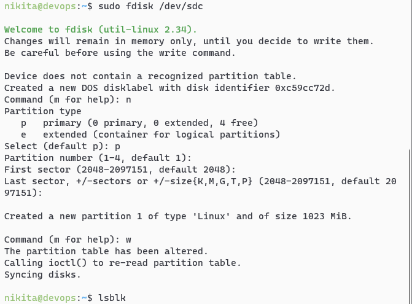
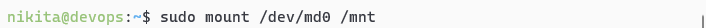
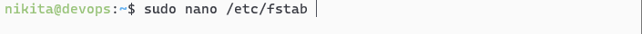
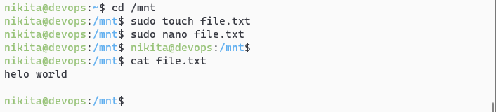

| МИНИСТЕРСТВО НАУКИ И ВЫСШЕГО ОБРАЗОВАНИЯ
| РОССИЙСКОЙ ФЕДЕРАЦИИ

| федеральное государственное автономное
| образовательное учреждение высшего образования
| «Самарский национальный исследовательский университет
| имени академика С.П. Королева»

(Самарский университет)

Институт информатики, математики и электроники

| Факультет информатики
| Кафедра суперкомпьютеров и общей информатики

**Отчет по лабораторной работе №1**

Дисциплина: «Развертывание и жизненный цикл программного обеспечения»

Тема: **«VM and RAID»**

Выполнил: Харитонов Н.В.

Группа: 6133-010402D

Самара 2021

**TASK**

Steps:

1. Create virtual machine with debian/ubuntu/centos or download
   preinstalled image (https://www.osboxes.org/).

2. Add simple raid1 to virtual machine: \*nix os system on 1-st hdd, 2d
   and 3d hdds are in raid1. 1 (with star). Only two hdds. Os system on
   raid1, based on this two hdd.

3. How to test raid1. Create file on raid1 file system. Turn off vm and
   remove one of the hhds from vm. Turn on vm. File should be
   accessible.

4. Add new hdd and sync it to raid1.

5. Add section with assignment1 description into docx and send by e-mail
   for checking.

**PROCEDURE**

Install an Ubuntu Server 20.04 virtual machine using Virtual Box and add
two additional HDDs to the VM:

.. image:: ./media/image1.png
   :width: 4.4493in
   :height: 3.63792in

Establish the connection from Windows to the VM with SSH in PowerShell
as shown on the picture below:

.. image:: ./media/image2.png
   :width: 6.49653in
   :height: 4.42708in

List all the disks of the VM using the lsblk command:|image1|

Create RAID1 based on sdb and sdc. In order to do that, create two
primary partitions sdb1 and sdc1 respectively with the fdisk utility
program:

.. image:: ./media/image4.png
   :width: 6.49653in
   :height: 4.67708in

Check for creation success:

.. image:: ./media/image6.png
   :width: 6.49653in
   :height: 3.74236in

The two partitions created successfully.

Create a RAID1 array in /dev/md0 based on the created partitions using
the mdadm command:

.. image:: ./media/image7.png
   :width: 6.49653in
   :height: 2.62361in

Create a file system based on RAID1:

.. image:: ./media/image8.png
   :width: 6.49653in
   :height: 2.42986in

Mount the file system:

Check for success:

.. image:: ./media/image10.png
   :width: 6.49653in
   :height: 3.18403in

Save the created partitions to mount them automatically each time the
system boots. In order to do that, get the UUID of the RAID1 array:

.. image:: ./media/image11.png
   :width: 6.49653in
   :height: 0.54306in

Then edit the /etc/fstab file containing the boot information and paste
the UUID in there with corresponding options:

Display the edited file:

.. image:: ./media/image13.png
   :width: 6.49653in
   :height: 3.37222in

Test RAID1. In order to do that, add a test file in the /mnt directory
as shown on the picture below:

Then remove sdc1 from RAID1 and check if the file is left:|image2|

The file left unaffected.

Turn off the VM and remove one of the disks:

.. image:: ./media/image16.png
   :width: 5.32477in
   :height: 4.35374in

Turn the VM back on and display its disks to check if sdc completely
removed but the file still left unaffected:

.. image:: ./media/image17.png
   :width: 6.49653in
   :height: 3.62014in

Turn the VM off and add a new HDD to it:

.. image:: ./media/image18.png
   :width: 5.26346in
   :height: 4.30361in

Turn the VM back on and display its disks:

.. image:: ./media/image19.png
   :width: 6.49653in
   :height: 3.45694in

The new HDD detected but not added to RAID. Add it with the following
command and check for success:

.. image:: ./media/image20.png
   :width: 6.49653in
   :height: 4.69097in

The test file still left unaffected.

**CONCLUSION**

In the conclusion of the laboratory work, the basic utilities of the
Ubuntu system studied for working with the file system, partitioning and
creating RAID arrays; all steps completed successfully.

.. |image1| image:: ./media/image3.png
   :width: 6.49653in
   :height: 3.125in
.. |image2| image:: ./media/image15.png
   :width: 6.28125in
   :height: 5.17361in
