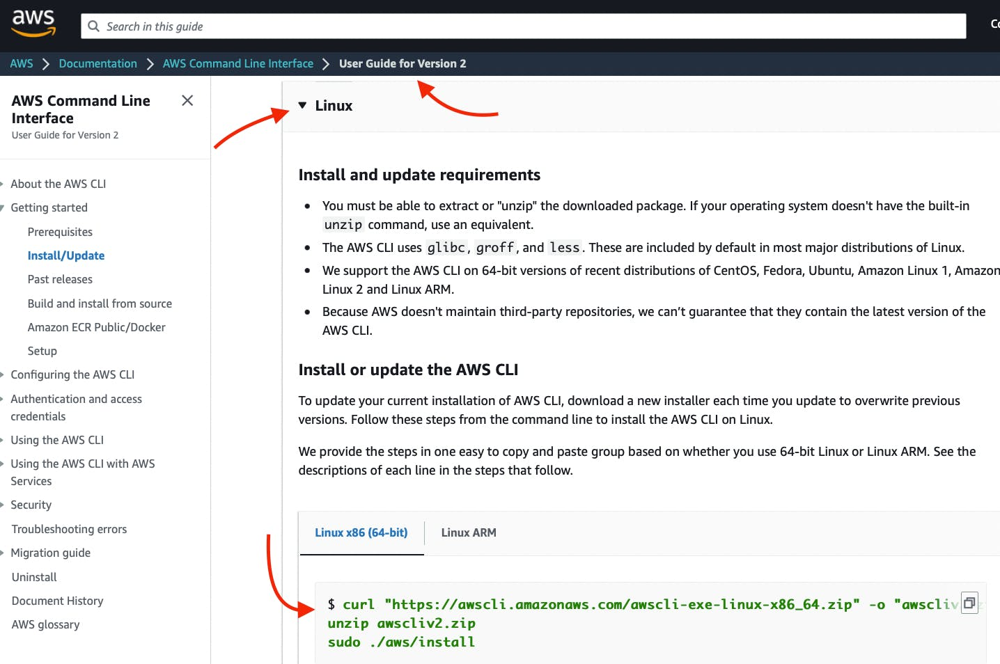
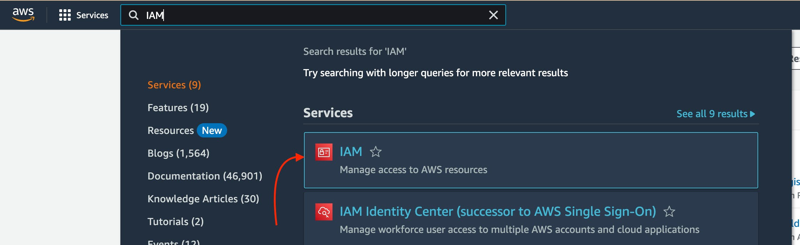
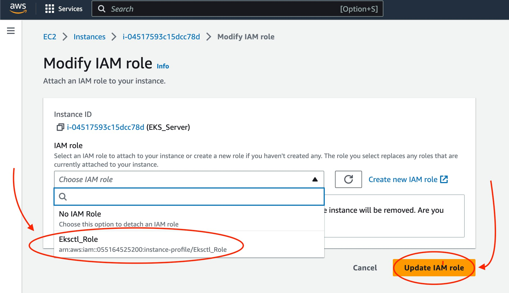
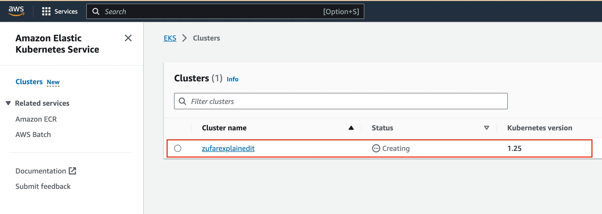
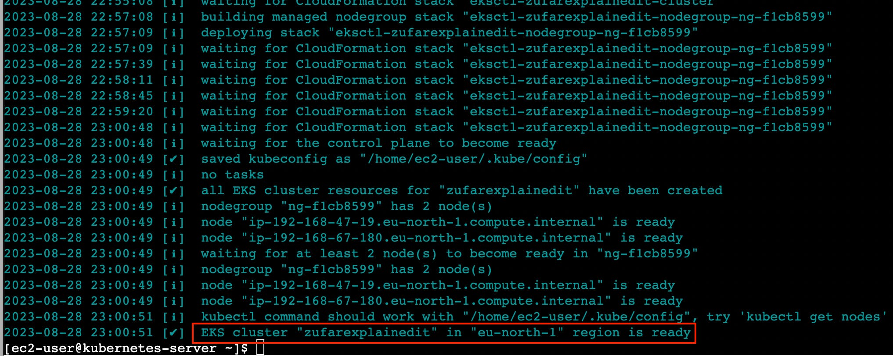
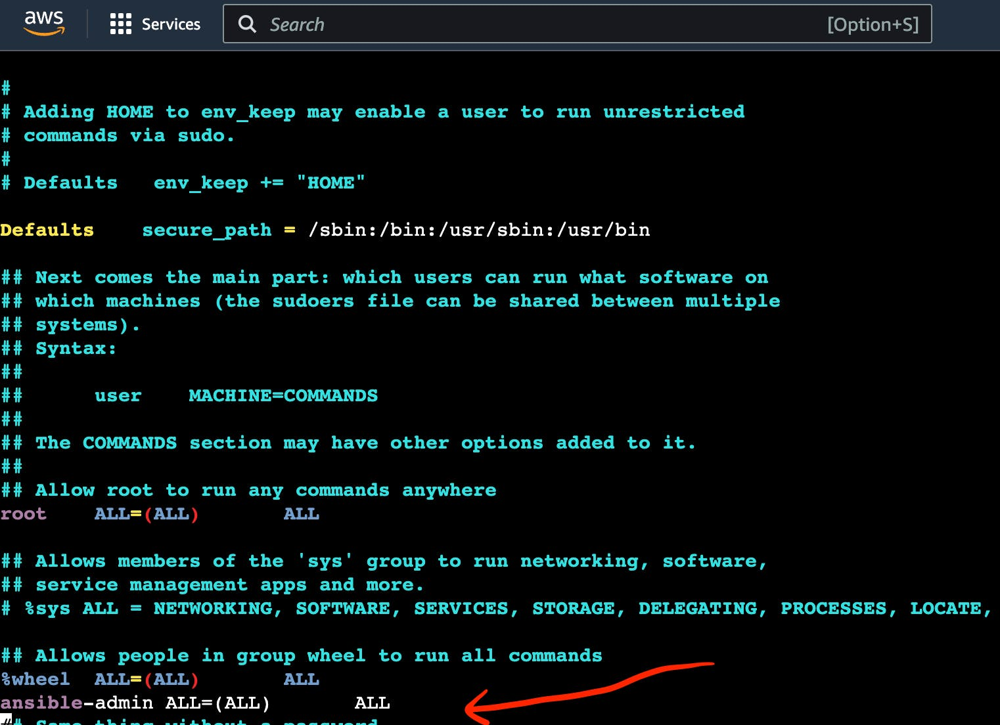
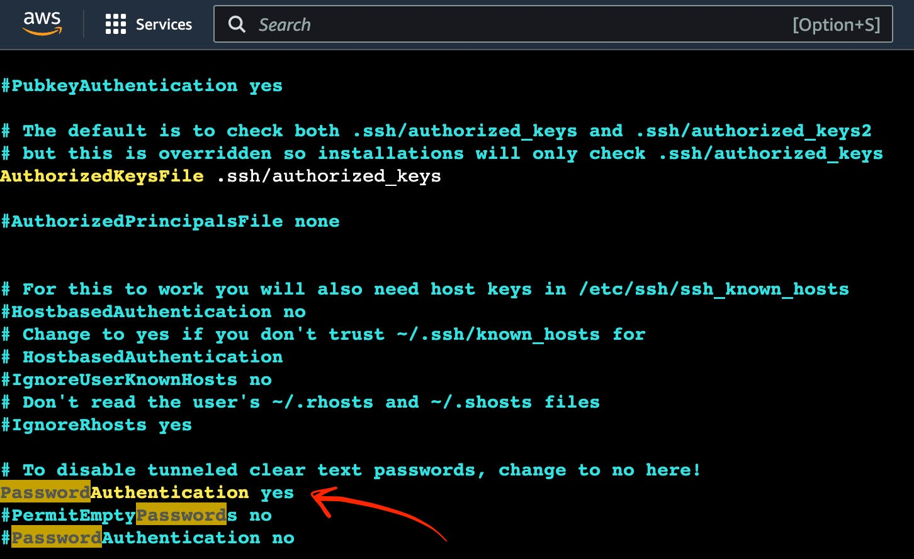
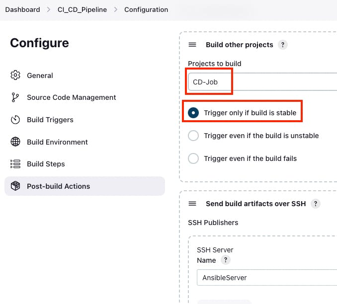

===========================================
Building a CI/CD Pipeline. Part4 Kubernetes
===========================================

1. Setup "minikube" or kubernetes cloud service.
2. Create ``hello-app-deployment.yaml`` file with hello-app
docker image deployment to kubernetes
3. Add image deployment step into Jenkins pipline
through Ansible (if you want) or directly without Ansible
4. Create screenshot of successful finished pipeline of Jenkins window.
   
---

For "on-premise" option - setup kubernetes with **minikube**  
  * For minicube - you can use steps from `Kubernetes install Tools` https://kubernetes.io/docs/tasks/tools/

To run minikube you will need:
  * at least 20 GB of free space on your VM hard drive
  * CPU: 2 core or more
  * RAM: ~1900 MB (1800 MB min for minikube + OS)

---

.. rubric:: **[Module 7]: Kubernetes**
   :name: h-module-7-kubernetes

Now let’s configure K8s on the EC2 instance. You are
going to create a new EC2 instance and install their
kubectl command-line tool for interacting with a
`Kubernetes <https://hackernoon.com/419-stories-to-learn-about-kubernetes>`__
cluster further.

.. rubric:: **Step 1: Launch an AWS EC2 Virtual Server
   instance**
   :name: h-step-1-launch-an-aws-ec-2-virtual-server-instance

Use instructions from “\ **Launch an AWS EC2 Virtual
Server instance”** section of this tutorial to finish
this step.

.. warning::

   Do not forget to add a security group setup. It
   allows **all tools** and **SSH** to work on
   port **8080** and **22** respectively.

.. note::

   Use the name **“K8sServer”** to distinguish your
   EC2 Virtual Server instance.

.. note::

   You can reuse **“CI_CD_Pipeline”** security group
   and **“CI_CD_Pipeline_Key_Pair“** for a
   new **“K8sServer”** EC2 instance.

.. rubric:: **Step 2: Connect to an AWS EC2 Virtual
   Server instance**
   :name: h-step-2-connect-to-an-aws-ec-2-virtual-server-instance

Click the “Connect” button.

.. figure:: media/CICD-by-Zufar/CICD-by-Zufar-83.png
    :scale: 50 %

    The screenshot of AWS web page with the pointer to
    "Connect" button

Now you can see the EC2 Virtual Server instance online
terminal.

.. figure:: media/CICD-by-Zufar/CICD-by-Zufar-84.png
    :scale: 50 %

    The screenshot of AWS EC2 Virtual Server instance
    online terminal

.. rubric:: **Step 3: Change the hostname of
   “KubernetesServer” AWS EC2 Virtual Server
   instance**
   :name: h-step-3-change-the-hostname-of-kubernetes-server-aws-ec-2-virtual-server-instance

The first thing you need to do when you want to
configure KuberenetesServer on EC2 virtual server
instance is to change its hostname.

Let’s do it. Execute this command to open hostname
file:

.. code:: bash

   sudo vi /etc/hostname

You should see something like this.

.. figure:: media/CICD-by-Zufar/CICD-by-Zufar-85.png
    :scale: 50 %

    The screenshot of AWS EC2 Virtual Server instance
    with hostname file

Replace this hostname with **“kubernetes-server” and**
then reboot it.

.. code:: bash

   sudo init 6

You will hostname was changed.

.. figure:: media/CICD-by-Zufar/CICD-by-Zufar-86.png
    :scale: 50 %

    The screenshot of AWS EC2 Virtual Server instance
    terminal with the pointer to hostname

.. rubric:: **Step 4: Check AWS CLI version**
   :name: h-step-4-check-aws-cli-version

Use this command to check the
`AWS <https://hackernoon.com/467-stories-to-learn-about-aws>`__
version.

.. code:: bash

   aws --version

This way you can see your current aws-cli version.

.. figure:: media/CICD-by-Zufar/CICD-by-Zufar-87.png
    :scale: 50 %

    The screenshot of AWS EC2 Virtual Server instance
    online terminal with aws version command result

If you can see version **aws-cli/1.18**, you should
download the latest version.

.. rubric:: **Step 5: Update AWS CLI**
   :name: h-step-5-update-aws-cli

Now as you found out that you have an old aws-cli
version on your EC2 instance you need to update it. To
that go to AWS → Documentation → AWS Command Line
Interface → User Guide for Version 2.

    The screenshot of AWS EC2 Virtual Server instance
    webpage with User Guide for Version 2

Copy-paste **the curl command**.

First, execute this command to download awscli version
2.

.. code:: bash

   curl "https://awscli.amazonaws.com/awscli-exe-linux-x86_64.zip" -o "awscliv2.zip"

Wait for the downloading process to commence.

You should see something like this.

.. figure:: media/CICD-by-Zufar/CICD-by-Zufar-89.png
    :scale: 50 %

    The screenshot of AWS EC2 Virtual Server instance
    online terminal with downloading aws version 2
    result

Second, you need to execute this command to unzip
awscli version 2 archive.

.. code:: bash

   unzip awscliv2.zip

Third, you should execute this command to install
awscli version 2.

.. code:: bash

   sudo ./aws/install

Then, reload the Kubernetes EC2 Virtual Server
instance online terminal.

Next, use this command to check the AWS version

.. code:: bash

   aws --version

You can see that aws cli has aws-cli/2.

.. figure:: media/CICD-by-Zufar/CICD-by-Zufar-90.png
    :scale: 50 %

    The screenshot of AWS EC2 Virtual Server instance
    online terminal with aws version coommand result

.. rubric:: **Step 6: Install kubectl**
   :name: h-step-6-install-kubectl

.. note::

   **Kubectl** is a fundamental command-line tool for
   interacting with any Kubernetes cluster, regardless
   of the underlying infrastructure. It allows you to
   manage resources, deploy applications, configure
   networking, access logs, and perform various other
   tasks within a Kubernetes cluster.

Now you need to install kubectl command-line tool for
interacting with a Kubernetes cluster further. To that
you need to go to **AWS** → **Documentation** →
**Amazon** **EKS** → **User** **Guide** →
**Installing** or **updating** **kubectl** →
**Linux**.

Or just click the
link `https://docs.aws.amazon.com/eks/latest/userguide/install-kubectl.html 

.. figure:: media/CICD-by-Zufar/CICD-by-Zufar-91.png
    :scale: 50 %

    The screenshot of AWS EKS User Guide

First, execute this command to download kubectl.

.. code:: bash

   curl -O https://s3.us-west-2.amazonaws.com/amazon-eks/1.27.1/2023-04-19/bin/linux/amd64/kubectl

Wait for the downloading process.

You will see something like this.

.. figure:: media/CICD-by-Zufar/CICD-by-Zufar-92.png
    :scale: 50 %

    The screenshot of AWS EC2 Virtual Server instance
    online terminal with downloading kubectl result

Give permission to kubectl.

.. code:: bash

   chmod +x kubectl

Move kubectl to /usr/local/bin folder.

.. code:: bash

   sudo mv kubectl /usr/local/bin

Check the version of kubectl.

.. code:: bash

   kubectl version --output=yaml

.. rubric:: **Step 7: Install eksctl**
   :name: h-step-7-install-eksctl

.. note::

   **Eksctl** is an another command-line tool which is
   tailored specifically to the Amazon EKS service.
   Eksctl can be used to create AWS EKS clusters,
   manage node groups, and perform tasks specific to
   EKS, such as integrating with IAM roles and other
   AWS services by abstracting away much of the AWS
   infrastructure setup and management.

Execute the command to download kubectl.

.. code:: bash
   curl --silent --location "https://github.com/weaveworks/eksctl/releases/latest/download/eksctl_$(uname -s)_amd64.tar.gz" | tar xz -C

Move eksctl to /usr/local/bin folder.

.. code:: bash

   sudo mv /tmp/eksctl /usr/local/bin

Check the version of eksctl.

.. code:: bash

   eksctl version

.. figure:: media/CICD-by-Zufar/CICD-by-Zufar-93.png
    :scale: 50 %

    The screenshot of AWS EC2 Virtual Server instance
    online terminal with eksctl version

.. rubric:: **Step 8: Create IAM Role for eksctl**
   :name: h-step-8-create-iam-role-for-eksctl

You need to create an IAM role and attach it to your
**“KubernetesServer”** EC2 instance.

To do that you need to find EC2 in the search box.

Choose EC2 Virtual Server by clicking the
link `https://us-east-1.console.aws.amazon.com/ec2 <https://us-east-1.console.aws.amazon.com/ec2/home?region=us-east-1>`__/.

    The screenshot of AWS web page with the pointer to
    "IAM"

Go to **IAM** **Dashboard** → **Roles**.

.. figure:: media/CICD-by-Zufar/CICD-by-Zufar-95.png
    :scale: 50 %

    The screenshot of AWS web page with the pointer to
    "IAM Roles"

Click the button **“Create role”** on the
**IAM** roles web page.

Then choose **“AWS service” , “EC2”.** And the
click **“Next”** button.

.. figure:: media/CICD-by-Zufar/CICD-by-Zufar-96.png
    :scale: 50 %

    The screenshot of AWS web page with the pointer to
    "IAM Roles configuration"

Then, find **“AmazonEC2FullAccess”**,
**“AmazonEC2FullAccess“**, **“IAMFullAccess“**,
**“AWSCloudFormationFullAccess“** in the search box
and then click the **“Add permissions”** button.

And then click the **“Next”** button.

.. figure:: media/CICD-by-Zufar/CICD-by-Zufar-97.png
    :scale: 50 %

    The screenshot of AWS web page with the pointer to
    AdministratorAccess permission

Then type **“Eksctl_Role”** into **“Role name”**
input.

And the click **“Create role”** button.

.. figure:: media/CICD-by-Zufar/CICD-by-Zufar-98.png
    :scale: 50 %

    The screenshot of AWS web page with the pointer to
    permission role configuration

The role is created finally.

.. rubric:: **Step 9: Connect IAM Role with eksctl**
   :name: h-step-9-connect-iam-role-with-eksctl

Go to the AWS EC2 instance web page.
Choose **“KuberbetesServer”.** Then click
**“Actions”** → **“Security”** → **“Modify IAM
Role”.**

.. figure:: media/CICD-by-Zufar/CICD-by-Zufar-99.png
    :scale: 50 %

    The screenshot of AWS web page with the pointer to
    KubernetesServer Security button

Choose **“Eksctl_Role”** and then click the **“Update
IAM role”** button.

    The screenshot of AWS web page with the pointer to
    Elsctl_Role IAM role

Now your IAM Role is connected with your
**“EKS_Server”** and eksctl tool.

.. rubric:: **Step 10: Create eksctl cluster**
   :name: h-step-10-create-eksctl-cluster

.. note::

   **An Amazon EKS (Elastic Kubernetes
   Service)** cluster is a managed Kubernetes
   environment on AWS, automating intricate
   infrastructure tasks like setup, scaling, and
   maintenance. It's essential as it provides an
   efficient, secure, and AWS-optimized platform for
   deploying, managing, and scaling containerized
   applications, streamlining operations and freeing
   developers to focus on coding rather than managing
   underlying infrastructure.

Now, it's time to set up your EKS cluster.

**To achieve this, follow these steps:**

#. Modify the following command with your specific
   information.

.. code:: bash

   eksctl create cluster --name cluster-name  \
   --region region-name \
   --node-type instance-type \
   --nodes-min 2 \
   --nodes-max 2 \ 
   --zones <AZ-1>,<AZ-2>

For example, in my case, it looks like this.

.. code:: bash

   eksctl create cluster --name zufarexplainedit  \
   --region eu-north-1 \
   --node-type t3.micro

2. Execute the modified command and patiently await
   the completion of the cluster creation process. You
   will notice that the EKS cluster status is
   indicated as **"creating"** on the AWS
   CloudFormation web page.

    The screenshot of AWS web page with the pointer to
    AWS CloudFormation where you can see EKS cluster
    "creating" status

The cluster creation procedure typically takes around
20 minutes. Once completed, the terminal will display
the outcome of the process.

    The screenshot of AWS web page with the pointer to
    AWS EC2 terminal where you can see EKS cluster
    creation result

Furthermore, you can verify the successful **EKS**
cluster creation status on the AWS CloudFormation web page.

.. figure:: media/CICD-by-Zufar/CICD-by-Zufar-103.png
    :scale: 50 %

    The screenshot of AWS web page with the pointer to
    AWS CloudFormation where you can see EKS cluster
    creation result

.. rubric:: **Step 11: Create Kubernetes Deployment
   yaml file**
   :name: h-step-11-create-kubernetes-deployment-yaml-file

.. note::

   **A Kubernetes Deployment YAML file** is a
   configuration script written in YAML format that
   defines how to manage and maintain a specific
   application or service within a Kubernetes cluster.
   It encapsulates instructions for orchestrating the
   deployment, scaling, updating, and monitoring of
   containers running the application. This file
   includes details such as the container image, the
   desired number of replicas, resource limits,
   environment variables, networking settings, and
   more. When applied to a Kubernetes cluster, the
   Deployment YAML file ensures the desired state of
   the application, automatically managing the
   creation, scaling, and recovery of containers to
   maintain the desired level of availability and
   reliability.

Now, as Kubernetes cluster, eksctl, kubectl are
installed and configured, you can create a Kubernetes
Deployment yaml file.

You can do that by executing the following command.

.. code:: bash

   touch hello-app-deployment.yaml

Then, edit this file by executing the following
command.

.. code:: bash

   vi hello-app-deployment.yaml

Add this content to the hello-app-deployment.yaml.

.. code:: yaml

   apiVersion: apps/v1 
   kind: Deployment
   metadata:
     name: zufarexplainedit-hello-app
     labels: 
        app: hello-app

   spec:
     replicas: 2 
     selector:
       matchLabels:
         app: hello-app

     template:
       metadata:
         labels:
           app: hello-app
       spec:
         containers:
         - name: hello-app
           image: zufarexplainedit/hello
           imagePullPolicy: Always
           ports:
           - containerPort: 8080
     strategy:
       type: RollingUpdate
       rollingUpdate:
         maxSurge: 1
         maxUnavailable: 1

Now hello-app-deployment.yaml is created and ready to
use.

.. rubric:: **Step 12: Create Kubernetes Service yaml
   file**
   :name: h-step-12-create-kubernetes-service-yaml-file

.. note::

   **A Kubernetes Service YAML file** is a
   configuration script written in YAML format that
   defines a network abstraction for a set of pods,
   allowing them to be accessed consistently within a
   Kubernetes cluster. This file outlines how the
   service should be discovered, accessed, and
   load-balanced by other services or external
   clients. It includes specifications like the
   service type (ClusterIP, NodePort, LoadBalancer),
   port numbers, selectors to identify pods, and more.
   When applied to a Kubernetes cluster, the Service
   YAML file creates a virtual IP and port that routes
   traffic to the appropriate pods, abstracting the
   underlying pod changes and providing a stable
   endpoint for communication, enabling seamless
   connectivity and dynamic scaling.

As Kubernetes cluster, eksctl, kubectl are installed
and configured, you can create Kubernetes Service yaml
file.

To do that you need to create a Kubernetes Service
yaml file by executing the following command.

.. code:: bash

   touch hello-app-service.yaml

Then, edit this file by executing the following
command.

.. code:: bash

   vi hello-app-service.yaml

Add this content to the hello-app-deployment.yaml.

.. code:: yaml

   apiVersion: v1
   kind: Service
   metadata:
     name: zufarexplainedit-hello-app-service
     labels:
       app: hello-app 
   spec:
     selector:
       app: hello-app 

     ports:
       - port: 8080
         targetPort: 8080

     type: LoadBalancer

Now hello-app-service.yaml is created and ready to
use.

.. rubric:: **Step 13: Test Kubernetes cluster using
   kubectl**
   :name: h-step-13-test-kubernetes-cluster-using-kubectl

With your Kubernetes EKS cluster successfully
installed, and configured, and your Kubernetes service
and deployment files ready, it's time to put things to
the test using kubectl commands.

#. **Apply Deployment.**

   Use the following command to apply the deployment
   configuration.

.. code:: bash

   kubectl apply -f hello-app-deployment.yaml

This will create a deployment with the specified
number of replicas and a rolling update strategy,
ensuring your application's availability and
manageability.

**2. Apply Service.**

Next, apply the service configuration.

.. code:: bash

   kubectl apply -f hello-app-service.yaml

This will set up a LoadBalancer type service, exposing
your application to the internet.

Note that it might take a short while for the
LoadBalancer to be provisioned and acquire an external
IP address.

3. **Check LoadBalancer Status.**

   Monitor the status of your service using.

.. code:: bash

   kubectl get service zufarexplainedit-hello-app-service

When an external IP is assigned, you're almost ready
to access your application.

4. **Access Your Application.**

   Using a web browser, enter the assigned external IP
   address followed by :8080. After a brief moment,
   the page will load, displaying the "HelloWorld"
   message. Keep in mind that the initial loading
   might take a few seconds.

.. figure:: media/CICD-by-Zufar/CICD-by-Zufar-104.png
    :scale: 50 %

    The screenshot of Hello app web page

.. note::

   .. rubric:: Cleaning Up with kubectl Commands
      :name: h-cleaning-up-with-kubectl-commands

   When you need to tidy up resources within your
   Kubernetes environment, you can use the following
   kubectl commands to effectively remove deployments,
   pods, and services.

**1. Delete All Deployments**.

To delete all deployments, you can use the
following command.

.. code:: bash

   kubectl delete deployments --all

This action ensures that no active deployment
instances are left in your cluster.

**2. Delete All Pods**.

If you need to delete all pods, whether they are
managed by a deployment or not, you can use the
following command.

.. code:: bash

   kubectl delete pods --all

Clearing pods can help reset your cluster state or
prepare for new deployments.

**3. Delete All Services**.

To clean up services that expose your applications
to the network, you can use the following command.

.. code:: bash

   kubectl delete services --all

Removing services may involve downtime, so consider
the implications before proceeding.

.. rubric:: **Deleting an Amazon EKS Cluster**
   :name: h-deleting-an-amazon-eks-cluster

To remove all the resources associated with the
specified Amazon EKS cluster created with
``eksctl``, including worker nodes, networking
components, and other resources, you can use the
following command.

.. code:: bash

   eksctl delete cluster --name {your cluster name} --region {your region name}

For me it is.

.. code:: bash

   eksctl delete cluster --name zufarexplainedit --region eu-north-1

Make sure you are certain about stopping the
cluster, as this action is irreversible and will
result in data loss.

.. rubric:: **Step 14: Add and configure a new user in
   “KubernetesServer” AWS EC2 Virtual Server
   instance**
   :name: h-step-14-add-and-configure-a-new-user-in-kubernetes-server-aws-ec-2-virtual-server-instance

Now let’s add a new **ansible-admin** user to
**“KubernetesServer”** AWS EC2 Virtual Server
instance.

To do that use this command.

.. code:: bash

   sudo useradd ansible-admin

Then, set the password for **ansible-admin** user.

.. code:: bash

   sudo passwd ansible-admin

Also, you need to configure user privileges by editing
the **sudoers** file.

.. code:: bash

   sudo visudo

Add **“ansible-admin ALL=(ALL) ALL”** to
this **sudoers** file.

    The screenshot of AWS EC2 Virtual Server instance
    terminal with the pointer to admin privileges

Also, you need to edit **/etc/ssh/sshd_config** file
to enable PasswordAuthentication.

.. code:: bash

   sudo vi /etc/ssh/sshd_config

    The screenshot of AWS EC2 Virtual Server instance
    terminal with the pointer to admin settings

Then you need to reload the service to make these
changes.

.. code:: bash

   sudo service sshd reload

As a result of executing this command, you will see:

.. figure:: media/CICD-by-Zufar/CICD-by-Zufar-107.png
    :scale: 50 %

    The screenshot of AWS EC2 Virtual Server instance
    terminal with the pointer to sshd reload result

.. note::

   Now you can use this command to avoid adding sudo
   for all further commands.

.. code:: bash

    sudo su - ansible-admin

.. rubric:: **Step 15: Generate key in an AWS EC2
   Virtual Server instance**
   :name: h-step-15-generate-key-in-an-aws-ec-2-virtual-server-instance

You are planning to manage remote servers such as
**K8s** EC2 virtual server instance further in this article.
That is why you need to set up SSH keys.

.. code:: bash

   ssh-keygen

As a result of executing this command, you will see:

.. figure:: media/CICD-by-Zufar/CICD-by-Zufar-108.png
    :scale: 50 %

    The screenshot of AWS EC2 Virtual Server instance
    terminal with the pointer to ssh-keygen result

Now SSH keys are generated and ready to use.

.. rubric:: **Step 16: Configure** Passwordless SSH
   authentication to localhost for Ansible
   :name: h-step-16-configure-passwordless-ssh-authentication-to-localhost-for-ansible

Ansible is designed for automating tasks on remote
servers. Passwordless SSH authentication empowers
Ansible to connect to those servers without the need
for manual password entry.

Execute this command to create a secure connection
from your computer to another computer (like the one
at IP address 172.31.34.41), using the ansible-admin
user's SSH key.

.. code:: bash

   sudo ssh-copy-id -i /home/{your user name}/.ssh/id_rsa.pub {your user name}@{your host address}

In my case, it looks like this.

.. code:: bash

   sudo ssh-copy-id -i /home/ansible-admin/.ssh/id_rsa.pub ansible-admin@172.31.34.41

.. figure:: media/CICD-by-Zufar/CICD-by-Zufar-109.png
    :scale: 50 %

    The screenshot of the successful passwordless ssh
    authentication installation result

Now you can see **“Number of key(s) added: 1”**. It
means that the passwordless SSH authentication
installation was successfully completed.

.. rubric:: **Step 17: Configure Ansible hosts in
   AnsibleServer EC2 instance**
   :name: h-step-17-configure-ansible-hosts-in-ansible-server-ec-2-instance

When you run an Ansible playbook, you specify the
hosts it should run on. In this step you need to
specify KubernetesServer EC2 instance host. To do that
you need to repeat the same steps which you passed in
“\ **[Module 6]: Ansible”.**

Let’s find out the KubernetesServer EC2 instance host
by executing the following command.

.. code:: bash

   sudo ifconfig

.. figure:: media/CICD-by-Zufar/CICD-by-Zufar-110.png
    :scale: 50 %

    The screenshot of "ifconfig" file

After you find the KubernetesServer EC2 instance host,
you can add it to the Ansible hosts file by executing
the following command.

.. code:: bash

   sudo vi /etc/ansible/hosts

.. figure:: media/CICD-by-Zufar/CICD-by-Zufar-111.png
    :scale: 50 %

    The screenshot of "hosts" files with ansible and
    kubernetes hosts

You can also add “[kubernetes]” as a reference

.. rubric:: **Step 18: Create a new Ansible playbook
   for Kubernetes tasks**
   :name: h-step-18-create-a-new-ansible-playbook-for-kubernetes-tasks

Now that Kubernetes is all setup and good to go, you
can make a new Ansible playbook with Kubernetes tasks
for your pipeline. This playbook will let Ansible run
your app on the Kubernetes cluster with kubectl
commands.

Here's how you can do it:

#. Start by creating a new Ansible playbook file. Just
   use this command.

.. code:: bash

   touch kubernetes-hello-app.yml

2. Then, edit the newly made ``hello-app.yml`` file.
   Open it up for editing with this command.

.. code:: bash

   vi kubernetes-hello-app.yml

3. Inside the file, type in the following:

.. code:: yaml

   ---
   - hosts: kubernetes

     tasks:
       - name: deploy regapp on kubernetes
         command: kubectl apply -f hello-app-deployment.yaml

       - name: create service for regapp
         command: kubectl apply -f hello-app-service.yaml

       - name: update deployment with new pods if image updated in docker hub
         command: kubectl rollout restart deployment.apps/zufarexplainedit-hello-app

The Ansible playbook for Kubernetes tasks is ready to
use.

.. rubric:: **Step 19: Integrate a new Ansible
   playbook for Kubernetes tasks with Jenkins**
   :name: h-step-19-integrate-a-new-ansible-playbook-for-kubernetes-tasks-with-jenkins

Now that Kubernetes, Ansible, and Ansible playbook for
Kubernetes tasks are all set up and good to go, you
can integrate it with Jenkins.

#. Go to JenkinsServer → Jenkins dashboard → New Item.

#. Create new Jenkins Freestyle project with the name
   “CD-Job”.

.. figure:: media/CICD-by-Zufar/CICD-by-Zufar-112.png
    :scale: 50 %

    The screenshot of a new Jenkins freestyle
    project "CD-Job"

#. Click “OK” button.

#. Go to “Post-build Actions” section.

#. Click the “Add post-build action” button.

#. Choose “Send build artifacts over SSH” option.

#. Choose “AnsibleServer” as SSH Server.

#. Add this command to “exec command” input.

.. code:: bash

   sudo -u ansible-admin ansible-playbook /opt/docker/kubernetes-hello-app.yml

9.  Click “Apply” and “Save” buttons.

10. Go to Jenkins dashboard → “CI_CD_Pipeline” →
    Configure → “Post-build Actions” section.

11. Click the “Add post-build action” button.

12. Choose “Build other projects” option.

13. Go to “Build other projects” section.

14. Choose “Trigger only if build is stable” option.

15. Add “CD-Job” to “Project to build” input.

    The screenshot of "Build other projects"
    section

16. Click “Apply” and “Save” buttons.

Now you can consider that the pipeline is completely
finished and ready to use.

.. rubric:: **Step 20: Testing the Final Pipeline
   Version**
   :name: h-step-20-testing-the-final-pipeline-version

Now is the time to put the final pipeline version to
the test.

Navigate to Jenkins → Jenkins dashboard →
"CI_CD_Pipeline".

Click the "Build Now" button.

To see the results, review the build console logs.

.. figure:: media/CICD-by-Zufar/CICD-by-Zufar-114.png
    :scale: 50 %

    The screenshot of the build console logs

You will notice that the "CD-Job" was triggered in the
build console logs, and the final status is marked as
SUCCESS.

4

Moreover, you can head to Dockerhub to confirm the
addition of the new Docker image.

And finally, you can access your application using a
web browser. Enter the assigned external IP address
followed by ":8080". After a brief moment, the page
will load, showing the "HelloWorld" message.

.. rubric:: **Conclusion**
   :name: h-conclusion

Well done on setting up this modern CI/CD pipeline!

You've done an awesome job, and you're a real hero!

Thanks for all your effort!
