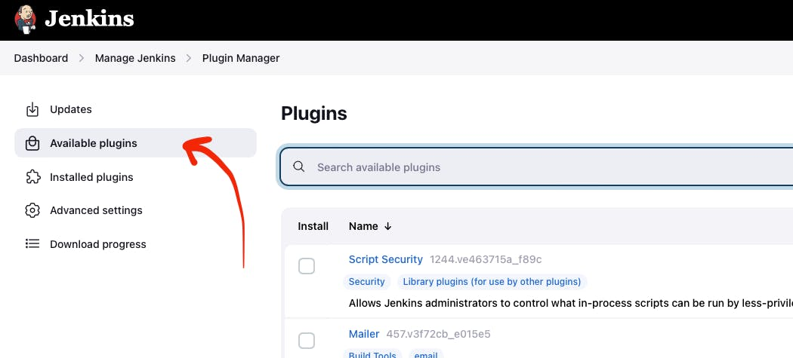
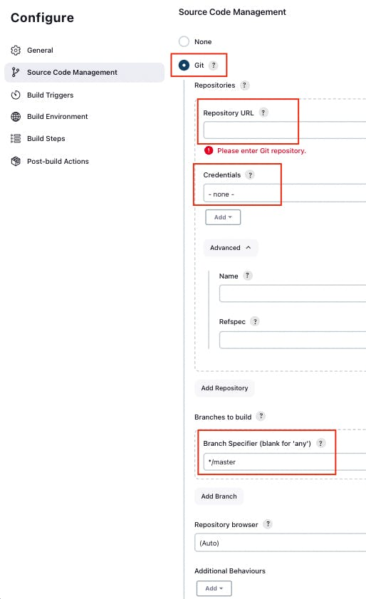
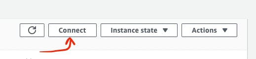
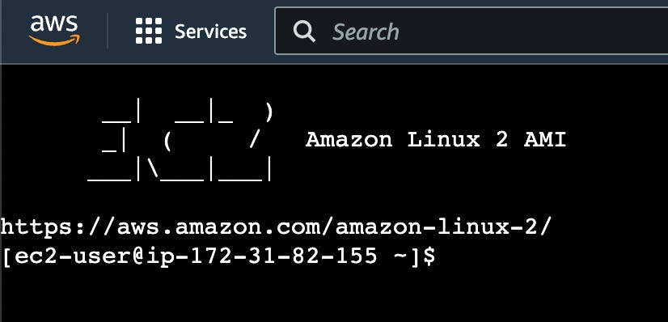
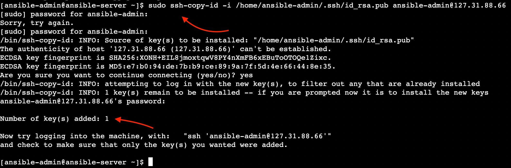

==============================================================================================================
Building a CI/CD Pipeline with AWS, K8S, Docker, Ansible, Git, Github, Apache Maven, and Jenkins \| HackerNoon
==============================================================================================================

Source: https://hackernoon.com/building-a-cicd-pipeline-with-aws-k8s-docker-ansible-git-github-apache-maven-and-jenkins

.. rubric:: **Motivation**
   :name: h-motivation

CI/CD is a technique for delivering apps to customers,
achieved by adding automation to different stages of
app development. I believe that grasping CI/CD
(Continuous Integration and Continuous Deployment) can
empower developers to gain a better understanding of
how backend project artifacts exist beyond the
boundaries of the project repository. This
comprehension can also create a fundamental shift in a
developer's perspective. Instead of merely viewing
their work as lines of code, they can start to embrace
the broader context of their project as a valuable
product.

In this article, we aim to demystify the CI/CD process
through practical application. We'll take you through
a step-by-step tutorial, breaking it down module by
module, where you'll build a CI/CD pipeline manually.
To do this, we'll harness the power of contemporary
DevOps tools like **AWS, Docker, Kubernetes, Ansible,
Git, Apache Maven,** and **Jenkins**. So, let's begin
this journey!

.. rubric:: **[Module 1]: AWS EC2 Virtual Server**
   :name: h-module-1-aws-ec-2-virtual-server

This module is dedicated to the creation of an AWS EC2
Virtual Server instance. As part of this article, you
will be setting up three EC2 instances for Jenkins,
Ansible, and Kubernetes. For now, you can proceed with
the next modules and revisit this module in "[module
2]: Jenkins", “[module 6]: Ansible" and "[module 7]:
Kubernetes" sections.

| 

.. rubric:: **Step 1: Create an AWS Account**
   :name: h-step-1-create-an-aws-account

Go to https://aws.amazon.com.

Click the button **Create an AWS Account**.

.. figure:: media/CICD-by-Zufar/CICD-by-Zufar-1.png
    :scale: 50 %
    
    The screenshot of AWS main web page with the
    pointer to "Create an AWS Account" button

Follow the instructions on the create account web
page.

.. rubric:: **Step 2: Sign In to your AWS Account**
   :name: h-step-2-sign-in-to-your-aws-account
    
Go to https://console.aws.amazon.com/console/home.
Click the **Sign In** button.

.. figure:: media/CICD-by-Zufar/CICD-by-Zufar-2.png
    :scale: 50 %

    The screenshot of AWS main web page with the
    pointer to "Sign In" button

Enter all necessary credentials on this web page.

.. rubric:: **Step 3: Find EC2 Virtual Server**
    :name: h-step-3-find-ec-2-virtual-server
    
Find EC2 in the search box.

.. figure:: media/CICD-by-Zufar/CICD-by-Zufar-3.png
    :scale: 50 %

    The screenshot of AWS web page with the pointer to
    the search box

Choose EC2 Virtual Server by clicking **EC2 Service**.

.. figure:: media/CICD-by-Zufar/CICD-by-Zufar-4.png
    :scale: 50 %

    The screenshot of AWS web page with the pointer to
    "EC2" AWS service

Click the button **Launch Instance**.

.. figure:: media/CICD-by-Zufar/CICD-by-Zufar-5.png
    :scale: 50 %

    The screenshot of AWS web page with the pointer to
    "Launch instance" button

.. rubric:: **Step 4: Configure “Name and tags“
    section**
    :name: h-step-4-configure-name-and-tags-section

Go to the **“Name and tags”** section.

.. figure:: media/CICD-by-Zufar/CICD-by-Zufar-6.png
    :scale: 50 %

    The screenshot of AWS web page with the pointer to
    "Name and tags" section

Provide a name for a new AWS EC2 Virtual Server
instance in the **“Name”** section.

.. figure:: media/CICD-by-Zufar/CICD-by-Zufar-7.png
    :scale: 50 %

    The screenshot of AWS web page with the pointer to
    "Name" input box in "Name and tags" section

You can also add additional tags for your virtual
server by clicking **”Add additional tags”**.

.. rubric:: **Step 5: Configure “Application and OS
    Images (Amazon Machine Image)“ section**
    :name: h-step-5-configure-application-and-os-images-amazon-machine-image-section

Go to the **"Application and OS Images (Amazon Machine
Image)"** section.

.. figure:: media/CICD-by-Zufar/CICD-by-Zufar-8.png
    :scale: 50 %

    The screenshot of AWS web page with the pointer to
    "Application and OS Images (Amazon Machine Image)"
    section

.. note::
    To play with the virtual server for **FREE**:

    #. Select the operating system for your virtual
        server - **Amazon Linux**.
    #. In the **Amazon Machine Image (AMI)** section,
        select a machine with the **Free tier eligible
        tag**.

.. figure:: media/CICD-by-Zufar/CICD-by-Zufar-9.png
    :scale: 50 %

    The screenshot of AWS web page with the pointer to
    "OS" and "Machine type" buttons in "Application and
    OS Images (Amazon Machine Image)" section

.. rubric:: **Step 6: Configure “Instance type“
    section**
    :name: h-step-6-configure-instance-type-section

Go to the **”Instance type”** section.

.. figure:: media/CICD-by-Zufar/CICD-by-Zufar-10.png
    :scale: 50 %

    The screenshot of AWS web page with the pointer to
    "Instance type" section

To play with the virtual server for **FREE**:

Select a type with the **Free tier eligible
tag** in the **Instance type** section.

For me it is **t2.micro (Family: t2 1cCPU 1 GiB
Memory Current generation:true)**.

.. figure:: media/CICD-by-Zufar/CICD-by-Zufar-11.png
    :scale: 50 %

    The screenshot of AWS web page with the pointer to
    "Instance type" dropdown in "Instance type" section

.. rubric:: **Step 7: Configure “Configure storage“
    section**
    :name: h-step-7-configure-configure-storage-section

Go to the **”Configure storage”** section.

.. figure:: media/CICD-by-Zufar/CICD-by-Zufar-12.png
    :scale: 50 %

    The screenshot of AWS web page with the pointer to
    "Configure storage" section

.. note::
    To play with the virtual server for **FREE**:
    Do not change default settings. Free tier eligible
    customers can get **30 GB of EBS General Purpose
    (SSD) or Magnetic storage**.

.. figure:: media/CICD-by-Zufar/CICD-by-Zufar-13.png
    :scale: 50 %

    The screenshot of AWS web page with the pointer to
    storage possible configurations in "Configure
    storage" section

.. rubric:: **Step 8: Configure “Network settings“
    section**
    :name: h-step-8-configure-network-settings-section

Go to the **“Network settings“** section.

.. figure:: media/CICD-by-Zufar/CICD-by-Zufar-14.png
    :scale: 50 %

    The screenshot of AWS web page with the pointer to
    "Network settings" section

You need to set up the security of your virtual
server. To do this,

#. Click on the **“Create security group”** button.
#. Add the name of your new security group in
the **“Security group name”** section.
#. Add a description of your new security group in
the **“Description”** section.

By default, your virtual server is accessible via
(**Type - SSH, Protocol - TCP, Port - 22**). If you
need additional connection types, add them by adding
additional inbound security group rules.    

.. figure:: media/CICD-by-Zufar/CICD-by-Zufar-15.png
    :scale: 50 %

    The screenshot of AWS web page with the pointer to
    "Security group" in "Network settings" section

.. rubric:: **Step 9: Configure “Key pair (login)“
   section**
   :name: h-step-9-configure-key-pair-login-section

Go to the **”Key pair (Login)”** section.

.. figure:: media/CICD-by-Zufar/CICD-by-Zufar-16.png

    The screenshot of AWS web page with the pointer to
    "Ket pair (login)" section

Create a new key-pair if you haven't created it yet.

.. figure:: media/CICD-by-Zufar/CICD-by-Zufar-17.png
    :scale: 50 %

    The screenshot of AWS web page with the pointer to
    "Key pair name", "Key pair type", "Private key file
    format" in "Ket pair (login)" section

If you haven't created **“key-pair”** yet:

#. Click the **“Create new key pair”** button.
#. Give your new key-pair a name in the **“Key pair
   name”** section.
#. Select key-pair type **RSA** or **ED25519**. I
   choose the **RSA** type.
#. Select Private key file format. Choice
   of **.pem** and **.ppk**. I choose
   the **.pem** format.
#. Click on the **“Create key pair”** button.
#. You will get a pop-up window that will prompt you
   to download the Private key file. Agree and
   download the file to your computer.

.. rubric:: **Step 10: Launch the EC2 Virtual Server
   Instance**
   :name: h-step-10-launch-the-ec-2-virtual-server-instance

Launch the EC2 Virtual Server instance by clicking the
button **“Launch instance”**.

.. figure:: media/CICD-by-Zufar/CICD-by-Zufar-18.png
    :scale: 50 %

    The screenshot of AWS web page with the pointer to
    "Launch Instance" button

After the completion of the EC2 Virtual Server
instance creation process, you will see the following.

.. figure:: media/CICD-by-Zufar/CICD-by-Zufar-19.png
    :scale: 50 %

    The screenshot of the AWS web page displaying a
    'Success' notification, indicating the successful
    completion of the EC2 Virtual Server instance
    creation process

Then you should go to the **“Instances“** section by
clicking **“View all instances”** button.

.. figure:: media/CICD-by-Zufar/CICD-by-Zufar-20.png
    :scale: 50 %

    The screenshot of AWS web page with the pointer to
    running EC2 instance

Now you can see that your AWS EC2 Virtual Server
instance is running.

--------------

.. rubric:: **[Module 2]: Jenkins Server**
   :name: h-module-2-jenkins-server

Now, let’s configure JenkinsServer on the EC2 Virtual
Server instance.

.. rubric:: **Step 1: Create an AWS EC2 Virtual Server
   instance**
   :name: h-step-1-create-an-aws-ec-2-virtual-server-instance

You need a virtual server to run Jenkins.

Follow instructions from **[Module 1]: AWS EC2 Virtual
Server** section of this tutorial to finish this step
and create an EC2 virtual server instance with the
name JenkinsServer.

.. warning::
   Do not forget to add a security group setup. It
   allows **Jenkins** and **SSH** to work on
   port **8080** and **22** respectively.

.. note::
   Use the name **“JenkinsServer”** to distinguish
   your EC2 Virtual Server instance.

.. note::
   Create **“CI_CD_Pipeline”** security group
   and **“CI_CD_Pipeline_Key_Pair“** for a
   new **“JenkinsServer”** AWS EC2 instance. You can
   reuse them further in the article.

.. rubric:: **Step 2: Connect to an AWS EC2 Virtual
   Server instance**
   :name: h-step-2-connect-to-an-aws-ec-2-virtual-server-instance

Go to **AWS Console home page** → **EC2 Management
Console Dashboard** → **Instances.**

Then you should choose **JenkinsServer** and then
click the **“Connect”** button.

.. figure:: media/CICD-by-Zufar/CICD-by-Zufar-21.png
    :scale: 50 %

    The screenshot of AWS "Instances" web page with the
    pointer to "Connect" button

Then you will see this web page. You should again
click the **“Connect”** button.

.. figure:: media/CICD-by-Zufar/CICD-by-Zufar-22.png
    :scale: 50 %

    The screenshot of AWS "Connect to Instance" web
    page with the pointer to "Connect" button

Now you can see EC2 virtual server instance online
terminal.

.. figure:: media/CICD-by-Zufar/CICD-by-Zufar-23.png
    :scale: 50 %

    The screenshot of AWS EC2 Virtual Server instance
    online terminal

.. rubric:: **Step 3: Download the Jenkins
   repository**
   :name: h-step-3-download-the-jenkins-repository

Now you need to download Jenkins on your EC2 virtual
server instance.

Follow these instructions:

#. Go to Jenkins
   download `webpage <https://www.jenkins.io/download>`__.

#. You can see Stable (LTS) and Regular releases
   (Weekly) options. Choose `Red
   Hat/Fedora/Alma/Rocky/CentOS <https://pkg.jenkins.io/redhat-stable>`__\ LTS
   option.

You will see this web page.

.. figure:: media/CICD-by-Zufar/CICD-by-Zufar-24.png
    :scale: 50 %

    The screenshot of Jenkins download web page

3. Copy **“sudo get..”** command and execute it to
   download Jenkins files from the Jenkins repository
   on the Internet and save them to the specified
   location on your EC2 virtual server instance.

.. code:: bash

   sudo wget -O /etc/yum.repos.d/jenkins.repo https://pkg.jenkins.io/redhat-stable/jenkins.repo

Now Jenkins is downloaded.

.. rubric:: **Step 4: Import Jenkins key**
   :name: h-step-4-import-jenkins-key

To finish the Jenkins installation, we need to import
the Jenkins key.

To import the Jenkins key we need to copy the **“sudo
rpm..”** command and execute it.

.. code:: bash

   sudo rpm --import https://pkg.jenkins.io/redhat-stable/jenkins.io-2023.key

.. container:: notice notice-info

   This way **“rpm”** package manager can verify that
   the Jenkins packages you install are exactly the
   ones published by the Jenkins project, and that
   they haven't been tampered with or corrupted.

.. rubric:: **Step 5: Install Java**
   :name: h-step-5-install-java

To run Jenkins, we need to install **Java** on our EC2
virtual server instance.

To install **Java**, use this command.

| 

.. code:: bash

   sudo amazon-linux-extras install java-openjdk11 -y

| 

Verify whether
**Java**
was installed correctly using this command:

.. code:: bash

   java -version

You will see something like that.

.. figure:: media/CICD-by-Zufar/CICD-by-Zufar-25.png
    :scale: 50 %

    The screenshot of AWS EC2 Virtual Server instance
    online terminal with installed JDK 11

.. rubric:: **Step 6: Install fontconfig**
   :name: h-step-6-install-fontconfig

To run Jenkins, you need to install **fontconfig** on
our EC2 virtual server instance.

Use this command.

.. code:: bash

   sudo yum install fontconfig java-11-openjdk -y

.. note::

   Fontconfig is a library designed to provide
   system-wide font configuration, customization and
   application access. It's required by Jenkins
   because Jenkins has features that render fonts.

.. rubric:: **Step 7: Install Jenkins**
   :name: h-step-7-install-jenkins

In earlier steps, you configured your EC2 virtual
server instance to use a specific Jenkins repository
and then you imported the GPG key associated with this
repository. Now, you need to run the command that will
search all the repositories it knows about, including
the Jenkins one you added, to find the Jenkins
package. Once it finds the Jenkins package in the
Jenkins repository, it will download and install it.

Let’s run this command.

.. code:: bash

   sudo yum install jenkins -y

.. rubric:: **Step 8: Start Jenkins**
   :name: h-step-8-start-jenkins

You can start Jenkins using this command.

.. code:: bash

   sudo systemctl start jenkins

To check that Jenkins is running use this command.

.. code:: bash

   sudo systemctl status jenkins

You will see the output as it is on the screenshot
below:

.. figure:: media/CICD-by-Zufar/CICD-by-Zufar-26.png
    :scale: 50 %

    The screenshot of AWS EC2 Virtual Server instance
    online terminal with installed Jenkins

Jenkins should now be up and running.

.. rubric:: **Step 9: Access Jenkins**
   :name: h-step-9-access-jenkins

To access the Jenkins application, open any web
browser and enter your EC2 instance’s public IP
address or domain name followed by port 8080.

.. code:: bash

   http://<your-ec2-ip>:8080

The first time you access Jenkins, it will be locked
with an autogenerated password.

.. figure:: media/CICD-by-Zufar/CICD-by-Zufar-27.png
    :scale: 50 %

    The screenshot of Jenkins installed on AWS EC2
    Virtual Server with the pointer to Administrator
    password

You need to display this password using the following
command.

.. code:: bash

   sudo cat /var/lib/jenkins/secrets/initialAdminPassword

Copy this password, return to your browser, paste it
into the Administrator password field, and click
"Continue".

Then you will be able to see this web page.

.. figure:: media/CICD-by-Zufar/CICD-by-Zufar-28.png
    :scale: 50 %

    The screenshot of Jenkins installed on AWS EC2
    Virtual Server with the pointer to "Customize
    Jenkins" web page

Now, you can use your Jenkins Server.

.. rubric:: **Step 10: Create new Jenkins pipeline**
   :name: h-step-10-create-new-jenkins-pipeline

Now, as Jenkins is working fine, you can start
creating the Jenkins pipeline. To create Jenkins
pipeline you need to create a new “Freestyle project”.
To create a new “Freestyle project” you need to go to
the Jenkins dashboard and click the **“New
Item”** button.

.. figure:: media/CICD-by-Zufar/CICD-by-Zufar-29.png
    :scale: 50 %

    The screenshot of Jenkins Dashboard web page with
    the pointer to "New Item" button

Enter the name of the Github “Freestyle project”
(“pipeline” name is going to be used further) and then
click the button **“OK”**.

.. figure:: media/CICD-by-Zufar/CICD-by-Zufar-30.png
    :scale: 50 %

    The screenshot of Jenkins New Item web page with
    the pointer to "Item name" item box

Then provide the **Description** of the pipeline.

.. figure:: media/CICD-by-Zufar/CICD-by-Zufar-31.png
    :scale: 50 %

    The screenshot of Jenkins Job configuration web
    page with the pointer to "Description" input box

Then click the button “Apply” and “Save”. After that,
it means you created the fundament of the pipeline
which is going to be built in this tutorial.

.. rubric:: **[Module 3]: Git and Github**
   :name: h-module-3-git-and-github

Now as Jenkins is running on AWS EC2 Virtual Server
instance, you can configure Git with the pipeline.

.. container:: notice notice-info

   Git is a `free and open
   source <https://git-scm.com/about/free-and-open-source>`__ distributed
   version control system (VCS) designed to help
   software teams keep track of every modification to
   the code in a special kind of database. If a
   mistake is made, developers can turn back the clock
   and compare earlier versions of the code to help
   fix the mistake while minimizing disruption to all
   team members. VCS is especially useful
   for `DevOps <https://www.atlassian.com/devops/what-is-devops>`__ teams
   since they help them to reduce development time and
   increase successful deployments [1].

Git as the most popular version control system enables
us to pull the latest code from your project Github
repository to your EC2 virtual server instance where
your Jenkins is installed.

.. rubric:: **Step 1: Install Git**
   :name: h-step-1-install-git

Use this command to install Git.

.. code:: bash

   sudo yum install git -y

Now verify Git is working, using this command.

.. code:: bash

   git --version

Now Git is working fine on EC2 Virtual Server
instance.

.. rubric:: **Step 2: Open Jenkins dashboard**
   :name: h-step-2-open-jenkins-dashboard

As Git is working fine on EC2 Virtual Server instance,
we can integrate Jenkins with Git now.

To start this integration let’s install Jenkins Github
plugin.

Go to Jenkins dashboard section.

.. figure:: media/CICD-by-Zufar/CICD-by-Zufar-32.png
    :scale: 50 %

    The screenshot of Jenkins dashboard

.. rubric:: **Step 3: Open Jenkins Plugin Manager**
   :name: h-step-3-open-jenkins-plugin-manager

Click the button **“Manage Jenkins”** and then click
the button **“Manage Plugins”**.

.. figure:: media/CICD-by-Zufar/CICD-by-Zufar-33.png
    :scale: 50 %

    The screenshot of Jenkins dashboard with the
    pointer to "Manage Plugins" button

.. rubric:: **Step 4: Find Github Jenkins plugin**
   :name: h-step-4-find-github-jenkins-plugin

Click the button **“Available plugins”**.

    The screenshot of Jenkins Plugin Manager web page
    with the pointer to "Available plugins" button

Find the **Github** plugin Search box.

.. figure:: media/CICD-by-Zufar/CICD-by-Zufar-35.png
    :scale: 50 %

    The screenshot of Jenkins Plugin Manager web page
    with the pointer to "Github" plugin

Select **Github** plugin.

.. rubric:: **Step 5: Install Github Jenkins plugin**
   :name: h-step-5-install-github-jenkins-plugin

Select **Github** plugin. And then click the
button **“Install without restart”**.

.. figure:: media/CICD-by-Zufar/CICD-by-Zufar-36.png
    :scale: 50 %

    The screenshot of Jenkins Plugin Manager web page
    with the pointer to "Install without restart"
    button

Wait for the end of the Github plugin downloading.

.. figure:: media/CICD-by-Zufar/CICD-by-Zufar-37.png
    :scale: 50 %

    The screenshot of Jenkins Plugin Manager web page
    with the downloading Github plugin

Yes! The Jenkins Github plugin is installed.

.. rubric:: **Step 6: Configure Github Jenkins
   Plugin**
   :name: h-step-6-configure-github-jenkins-plugin

Now as the GitHub Jenkins plugin is installed, you can
configure this plugin to integrate Jenkins with Git
finally. To do that you need to return to the main
page by clicking the button “Go back to the top page”.

.. figure:: media/CICD-by-Zufar/CICD-by-Zufar-38.png
    :scale: 50 %

    The screenshot of Jenkins Plugin Manager web page
    with the pointer to "Go back to the top page"
    button

Then on the main page, you need to click the
button **“Manage Jenkins”** and then click the
button **“Global tool configuration”**.

.. figure:: media/CICD-by-Zufar/CICD-by-Zufar-39.png
    :scale: 50 %

    The screenshot of Jenkins Plugin Manager web page
    with the pointer to "Global tool configuration"
    button

Then on the Global Tool Configuration web page you
should go to the Git section.

.. figure:: media/CICD-by-Zufar/CICD-by-Zufar-40.png
    :scale: 50 %

    The screenshot of Jenkins Global Tool Configuration
    web page with the pointer to "Name" and "Path to
    Git executable" input boxes

In the Git section, you need to configure Git by
providing the name and path to Git on the computer.

Then click the
**“Apply”** and **“Save”** buttons**.*\*

Here, you have finished configuring the Jenkins Github
plugin.

.. rubric:: **Step 7: Integrate Git into the
   pipeline**
   :name: h-step-7-integrate-git-into-the-pipeline

Now, as the Jenkins Github plugin is installed and
configured, you're now able to utilize this plugin
within your pipeline. This will allow your pipeline
which you created in module 2 to pull your project
code from the specified GitHub repository.

Well, to integrate this plugin into your pipeline you
need to go to the Source Code Management section and
choose Git in your pipeline. Then you need to provide
your project repository URL. If your project
repository is public on Github, you do not need to
provide credentials. If the project repository is
private on Github, you need to provide credentials.

    The screenshot of Jenkins Job configuration web
    page with "Source Code Management" settings

You can use my project with the next Repositiry
URL: `https://github.com/Sunagatov/Hello.git <https://github.com/Sunagatov/Hello.git>`__.

Just copy and paste it to the “\ **Repository
URL”** input. Then click the
**“Apply”** and **“Save”** buttons to finish the
integration Git with the pipeline.

.. rubric:: **Step 8: Test Git integrated into the
   pipeline**
   :name: h-step-8-test-git-integrated-into-the-pipeline

Now you can use your updated pipeline to pull a
project from Github. To do that you need to click
the **“Build Now”**button. As a result, you will see a
successful build in the build history.

.. figure:: media/CICD-by-Zufar/CICD-by-Zufar-42.png
    :scale: 50 %

    The screenshot of Jenkins web page with pointers to
    "Build Now" button and "Build History" section

Open the first build from the build history.

.. figure:: media/CICD-by-Zufar/CICD-by-Zufar-43.png
    :scale: 50 %

    The screenshot of Jenkins Pull_Code_From_Github_Job
    with successful job result

Now you can see the successful job result of the first
build. If you open your AWS EC2 terminal. You can
check that the pipeline works well.

Just use this command.

.. code:: bash

   cd /var/lib/jenkins/workspace/{your pipeline name}

This way you can see that your project from Github was
pulled to your AWS EC2 virtual server instance.

.. figure:: media/CICD-by-Zufar/CICD-by-Zufar-44.png
    :scale: 50 %

    The screenshot of Github project downloaded into
    EC2 instance terminal

.. rubric:: **[Module 4]: Apache Maven**
   :name: h-module-4-apache-maven

.. note::

   **Apache Maven** is a widely used build automation
   and project management tool in software
   development. It streamlines the process of
   compiling, testing, and packaging code by managing
   project dependencies and providing a consistent
   build lifecycle. Maven employs XML-based
   configuration files (POM files) to define project
   structure, dependencies, and tasks, enabling
   developers to efficiently manage and deploy complex
   software projects.

Now that you have integrated Git into the pipeline,
you can enhance the pipeline further by incorporating
Apache Maven which enables you to build, test, and
package your project. To do that you need to install
Apache Maven on your AWS EC2 Virtual Server instance
where Jenkins and Git were installed.

.. rubric:: **Step 1: Download Apache Maven**
   :name: h-step-1-download-apache-maven

To download Apache Maven go to the
**“/opt”** directory.

.. code:: bash

   cd /opt

And then use this command.

.. code:: bash

   sudo wget https://dlcdn.apache.org/maven/maven-3/3.9.4/binaries/apache-maven-3.9.4-bin.tar.gz

This command will download the latest official Apache
Maven (check the latest version on the official Apache
Maven website). To find the latest official Apache
Maven release, use the
link `https://maven.apache.org/download.cgi <https://maven.apache.org/download.cgi>`__.

.. rubric:: **Step 2: Extract Apache Maven from the
   archive**
   :name: h-step-2-extract-apache-maven-from-the-archive

Use this command, to extract Apache Maven from the
downloaded archive:

.. code:: bash

   sudo tar -xvzf apache-maven-*.tar.gz

.. rubric:: **Step 3: Add JAVA_HOME and M2_HOME**
   :name: h-step-3-add-java-home-and-m-2-home

Move to the root folder using this command.

.. code:: bash

   cd ~

Edit **.bash_profile** file using this command.

.. code:: bash

   vi .bash_profile

Add **JAVA_HOME** and M2_HOME variables.

Assign the path to JDK11 for **JAVA_HOME** and path to
the maven directory for **M2_HOME** variable.

To find JDK path, use this command.

.. code:: bash

   sudo find / -name java

.. figure:: media/CICD-by-Zufar/CICD-by-Zufar-45.png
    :scale: 50 %

    The screenshot of AWS EC2 Virtual Server instance
    terminal web page with .bash_profile file

.. note::

   **How to use VIM**

   -  To **edit** the file press the keyboard
      button **“ I “** to insert data.
   -  To **save** the file press the keyboard button “
      esc “ and enter “:w“.
   -  To **exit** from the file press the keyboard
      button **“ esc “** and enter **“:q”**.

Save the changes.

Then, execute this command to refresh system
variables.

.. code:: bash

   source .bash_profile

To verify **$PATH**, use this command.

.. code:: bash

   echo $PATH

To verify **Apache Maven**, use this command.

.. code:: bash

   mvn -v

If you have done everything correctly, you will be
able to view the version of Apache Maven.

.. figure:: media/CICD-by-Zufar/CICD-by-Zufar-46.png
    :scale: 50 %

    The screenshot of AWS EC2 Virtual Server instance
    terminal web page with the version of Apache Maven

.. rubric:: **Step 4: Install Apache Maven Jenkins
   plugin**
   :name: h-step-4-install-apache-maven-jenkins-plugin

Since Apache Maven can be used on an EC2 instance, you
can install the Apache Maven plugin to integrate it
with the pipeline.

**To achieve this, follow these steps:**

#. Navigate to **“Dashboard“** **→ “Manage Jenkins“ →
   “Manage Plugins“ → “Available”.**
#. In the search box, enter **“Maven”**.
#. Choose **“Maven Integration”** plugin.

.. figure:: media/CICD-by-Zufar/CICD-by-Zufar-47.png
    :scale: 50 %

    The screenshot of Jenkins installed on AWS EC2
    Virtual Server with the pointer to Maven plugin

Wait for the end of the downloading process.

And then click the button **“Go back to the top
page”**.

.. figure:: media/CICD-by-Zufar/CICD-by-Zufar-48.png
    :scale: 50 %

    The screenshot of Jenkins installed on AWS EC2
    Virtual Server with the pointer to Maven plugin
    downloading process

.. rubric:: **Step 5: Configure Apache Maven Jenkins
   plugin**
   :name: h-step-5-configure-apache-maven-jenkins-plugin

With the successful installation of the Apache Maven
Jenkins plugin, you are now able to utilize this
plugin within the pipeline which you created and
updated in modules 2 and 3.

**To do so, follow these steps:**

#. Go to **“Dashboard“** **→ “Manage Jenkins“ →
   “Global Tool Coonfiguration“ → “JDK”**
#. Click the button **“Add JDK”.**
#. Uncheck **“Install automatically”.**

.. figure:: media/CICD-by-Zufar/CICD-by-Zufar-49.png
    :scale: 50 %

    The screenshot of Jenkins installed on AWS EC2
    Virtual Server with the pointer to JDK
    configuration

Then go to **“Maven”** section. Click the
button **“Add Maven”**. Uncheck **“Install
automatically”.**

Then add **name** and **MAVEN_HOME** path.

.. figure:: media/CICD-by-Zufar/CICD-by-Zufar-50.png
    :scale: 50 %

    The screenshot of Jenkins installed on AWS EC2
    Virtual Server with the pointer to Apache Maven
    configuration

Click the **“Apply”** and **“Save”** buttons.

Here, you have finished configuring the Apache Maven
Jenkins plugin.

.. rubric:: **Step 6: Integrate Apache Maven into the
   pipeline**
   :name: h-step-6-integrate-apache-maven-into-the-pipeline

Now as the Apache Maven GitHub plugin is installed and
configured, you're now able to utilize Apache Maven
within your pipeline. This will allow your pipeline
which you created in the “[module 2]: Jenkins Server”
to build your project code to create a jar artifact.

**To integrate Apache Maven into the pipeline you need
to follow these steps:**

#. Navigate to **“Dashboard“** **→ “CI_CD_Pipeline“ →
   “Configure“ → “Build Steps”.**
#. Click **“Add build step”** button.
#. Choose **“Invoke top-level Maven targets”** option.
#. Choose **“Apache-Maven”** as **“Maven Version”.**
#. Add **“clean package”** command
   to **“Goals”** input.
#. Click **“Advanced“** button.
#. Add “pom.xml” to **“POM”** input.

.. figure:: media/CICD-by-Zufar/CICD-by-Zufar-51.png
    :scale: 50 %

    The screenshot of "Build Steps" section in the
    pipeline configuration with pointers to "Apply" and
    "Save" buttons

Finally, you should
click **“Apply”** and **“Save”** buttons to finish the
integration of Apache Maven with the pipeline.

.. rubric:: **Step 7: Test Apache Maven integrated
   into the pipeline**
   :name: h-step-7-test-apache-maven-integrated-into-the-pipeline

Now you can use your updated pipeline to build your
Github project. To do that you need to click
the **“Build Now”**button. As a result, you will see a
successful job result in the build history.

If you open your AWS EC2 terminal. You can check that
the pipeline works well.

Just use this command.

.. code:: bash

   cd /var/lib/jenkins/workspace/{your pipeline name}/target

This way you can see the JAR artifact, indicating the
successful build of your project from GitHub.

.. rubric:: **[Module 5]: Docker**
   :name: h-module-5-docker

Now let’s create a new EC2 instance with the name
"Ansible Server" where you are going to install Docker
and Ansible.

.. rubric:: **Step 1: Launch an AWS EC2 Virtual Server
   instance**
   :name: h-step-1-launch-an-aws-ec-2-virtual-server-instance

Use instructions from “\ **Launch an AWS EC2 Virtual
Server instance”** section of this tutorial to finish
this step. Do not forget to add a security group
setup. It allows Docker and SSH to work on ports 8080
and 22 respectively.

.. rubric:: **Step 2: Connect to an AWS EC2 Virtual
   Server instance**
   :name: h-step-2-connect-to-an-aws-ec-2-virtual-server-instance

Click the “Connect” button.

    The screenshot of AWS web page with the pointer to
    "Connect" button

Now you can see the EC2 Virtual Server instance online
terminal.

    The screenshot of AWS EC2 Virtual Server instance
    online terminal

.. code:: bash

   sudo chown ansible-admin:ansible-admin /opt/docker

.. rubric:: **Step 3: Install Docker on the Ansible
   EC2 virtual server.**
   :name: h-step-3-install-docker-on-the-ansible-ec-2-virtual-server

Now you need to install docker on your Ansible EC2
instance. To do that you need to create a new docker
folder.

.. code:: bash

   sudo mkdir /opt/docker

Then, install docker by executing the next command.

.. code:: bash

   sudo yum install docker -y

.. rubric:: **Step 4: Add current user to Docker group
   on Ansible EC2 virtual server**
   :name: h-step-4-add-current-user-to-docker-group-on-ansible-ec-2-virtual-server

You need to add the current
user **“ansible-admin”** to the Docker group on the
**“AnsibleServer”** EC2 virtual server to give Docker
admin privileges.

.. code:: bash

   sudo usermod -a -G docker ansible-admin

You will need to logout and log back in for these
changes to take effect.

Then you can execute the next command

.. code:: bash

   id ansible-admin

to see that the new docker user exists.

.. figure:: media/CICD-by-Zufar/CICD-by-Zufar-54.png
    :scale: 50 %

    The screenshot of Ansible EC2 instance with the
    pointer to the docker user

.. rubric:: **Step 5: Launch Docker**
   :name: h-step-5-launch-docker

Now as Docker is installed on the Ansible EC2 instance
you can launch it by executing the next command.

.. code:: bash

   sudo systemctl start docker

As Docker is started you can execute the next command

.. code:: bash

   sudo systemctl status docker

to see that docker is active and running now.

.. figure:: media/CICD-by-Zufar/CICD-by-Zufar-55.png
    :scale: 50 %

    The screenshot of Ansible EC2 instance with the
    active docker status

.. rubric:: **Step 6: Create Dockerfile**
   :name: h-step-6-create-dockerfile

In the final version of the pipeline, the process will
involve creating a new Docker image from your GitHub
project and pushing it to Docker Hub. To accomplish
this, your GitHub project should contain a Dockerfile.

If you used the project **“Hello”** which was offered
in “\ **[Module 3]: Git and Github”** module, then you
don’t need to create a new Dockerfile as this project
repository has already contained Dockerfile.

.. code:: bash

   FROM eclipse-temurin:17-jre-jammy
   ENV HOME=/opt/app
   WORKDIR $HOME
   ADD hello-0.0.1-SNAPSHOT.jar $HOME
   ENTRYPOINT ["java", "-jar", "/opt/app/hello-0.0.1-SNAPSHOT.jar" ]

If you used your own project repository and it didn't
contain a Dockerfile, you will need to create a new
Dockerfile.

To create a new Dockerfile, execute the following
command, which will create the new file.

.. code:: bash

   sudo touch Dockerfile

Then you can fill this file with a sequence of
commands that describe how to build a containerized
application environment. These commands include
actions like copying files into the image, installing
software, setting environment variables, and
configuring the container.

To fill the Dockerfile with these commands, execute
the following command.

.. code:: bash

   vim Dockerfile

The Dockerfile is ready to use.

.. rubric:: **Step 7: Login Docker**
   :name: h-step-7-login-docker

Now that your Dockerfile is prepared for use, proceed
by copying your project's JAR artifact from
the **"JenkinsServer"**EC2 instance and pasting it
onto the **"AnsibleServer"** EC2 instance. It is
important to note that this transfer will be automated
through the pipeline further.

By completing this step, you'll be ready to test your
Dockerfile along with the Docker environment you've
set up.

Before you begin testing, make sure to authenticate
yourself on Dockerhub. Execute the following command.

.. code:: bash

   docker login

This command will prompt you to provide your Dockerhub
login credentials, including your username and
password.

.. figure:: media/CICD-by-Zufar/CICD-by-Zufar-56.png
    :scale: 50 %

    The screenshot of successful docker login in
    "AnsibleServer" EC2 instance

With this, you have completed the process of logging
into
`Docker <https://hackernoon.com/306-stories-to-learn-about-docker>`__
and are now ready to proceed with testing.

.. rubric:: **Step 8:** Testing the Docker environment
   and Dockerfile
   :name: h-step-8-testing-the-docker-environment-and-dockerfile

With your successful login to Dockerhub completed, you
are now ready to begin testing the Dockerfile you have
prepared.

Execute this command to create a docker image.

.. code:: bash

   docker build -t hello:latest .

Next, execute the subsequent command to establish a
tag that will facilitate the image's upload to
Dockerhub:

.. code:: bash

   docker tag hello:latest zufarexplainedit/hello:latest

Finally, proceed to push the Docker image to Dockerhub
through the execution of this command.

.. code:: bash

   docker push zufarexplainedit/hello:latest

Following these steps, navigate to your Dockerhub
account to verify whether you can see a new image or
not.

.. figure:: media/CICD-by-Zufar/CICD-by-Zufar-57.png
    :scale: 50 %

    The screenshot of Dockerhub account with the new
    image added

You should now observe that the image has been
effectively added. This outcome confirms the
successful installation of the Docker environment and
that your Dockerfile is correct.

.. rubric:: **[Module 6]: Ansible**
   :name: h-module-6-ansible

Now let us configure the Ansible Server on the EC2
Virtual Server instance.

.. rubric:: **Step 1: Create an AWS EC2 Virtual Server
   instance**
   :name: h-step-1-create-an-aws-ec-2-virtual-server-instance

You need a virtual server to run Ansible.

Follow instructions from **[Module 1]: AWS EC2 Virtual
Server** section of this tutorial to finish this step
and create an EC2 virtual server instance for Ansible.

.. warning::

   Do not forget to add a security group setup. It
   allows **Ansible** and **SSH** to work on
   port **8080** and **22** respectively.

.. note::

   Use the name **“AnsibleServer”** to distinguish
   your EC2 Virtual Server instance.

.. note::

   You can reuse **“CI_CD_Pipeline”** security group
   and **“CI_CD_Pipeline_Key_Pair“** for a
   new **“AnsibleServer”** EC2 instance.

.. rubric:: **Step 2: Connect to an AWS EC2 Virtual
   Server instance**
   :name: h-step-2-connect-to-an-aws-ec-2-virtual-server-instance

Go to AWS Console home page → EC2 Management Console
Dashboard → Instances → AnsibleServer.

Then click the **“Connect”** button.

.. figure:: media/CICD-by-Zufar/CICD-by-Zufar-58.png
    :scale: 50 %

    The screenshot of AWS web page with the pointer to
    "Connect" button

Then you will see this web page. You should again
click the **“Connect”** button.

.. figure:: media/CICD-by-Zufar/CICD-by-Zufar-59.png
    :scale: 50 %

    The screenshot of AWS "Connect to Instance" web
    page with the pointer to "Connect" button

Now you can see the EC2 virtual server instance online
terminal.

.. figure:: media/CICD-by-Zufar/CICD-by-Zufar-60.png
    :scale: 50 %

    The screenshot of AWS EC2 Virtual Server instance
    online terminal

Now let’s configure Ansible Server on EC2 virtual
server instance.

.. rubric:: **Step 3: Change the hostname of
   “AnsibleServer” AWS EC2 Virtual Server instance**
   :name: h-step-3-change-the-hostname-of-ansible-server-aws-ec-2-virtual-server-instance

The first thing you need to do when you want to
configure AnsibleServer on EC2 virtual server instance
is changing its hostname.

Let’s do it. Execute this command to open hostname
file:

.. code:: bash

   sudo vi /etc/hostname

You should see something like this:

.. figure:: media/CICD-by-Zufar/CICD-by-Zufar-61.png
    :scale: 50 %

    The screenshot of AWS EC2 Virtual Server instance
    with hostname file

Replace this hostname with **“ansible-server”.** Then,
reboot it.

.. code:: bash

   sudo init 6

.. figure:: media/CICD-by-Zufar/CICD-by-Zufar-62.png
    :scale: 50 %

    The screenshot of AWS EC2 Virtual Server instance
    terminal with the pointer to hostname

.. rubric:: **Step 4: Add and configure a new user in
   “AnsibleServer” AWS EC2 Virtual Server instance**
   :name: h-step-4-add-and-configure-a-new-user-in-ansible-server-aws-ec-2-virtual-server-instance

Now let’s add a new **ansible-admin** user to the AWS
EC2 Virtual Server instance.

To do that use this command:

.. code:: bash

   sudo useradd ansible-admin

Then, set the password for **ansible-admin** user.

.. code:: bash

   sudo passwd ansible-admin

Also, you need to configure user privileges by editing
the **sudoers** file.

.. code:: bash

   sudo visudo

Add **“ansible-admin ALL=(ALL) ALL”** to
this **sudoers** file.

.. figure:: media/CICD-by-Zufar/CICD-by-Zufar-63.png
    :scale: 50 %

    The screenshot of AWS EC2 Virtual Server instance
    terminal with the pointer to admin privileges

Also, you need to edit **/etc/ssh/sshd_config** file
to enable PasswordAuthentication.

.. code:: bash

   sudo vi /etc/ssh/sshd_config

.. figure:: media/CICD-by-Zufar/CICD-by-Zufar-64.png
    :scale: 50 %

    The screenshot of AWS EC2 Virtual Server instance
    terminal with the pointer to admin settings

Then you need to reload the service to confirm these
changes.

.. code:: bash

   sudo service sshd reload

As a result of executing this command, you will see:

.. figure:: media/CICD-by-Zufar/CICD-by-Zufar-65.png
    :scale: 50 %

    The screenshot of AWS EC2 Virtual Server instance
    terminal with the pointer to sshd reload result

.. note::

   Now you can use this command to avoid adding sudo
   for all further commands.

   .. code:: bash

      sudo su - ansible-admin

.. rubric:: **Step 5: Generate key in an AWS EC2
   Virtual Server instance**
   :name: h-step-5-generate-key-in-an-aws-ec-2-virtual-server-instance

You are planning to manage remote servers such as K8s
EC2 virtual server instances further in this article.
That is why you need to set up SSH keys.

.. code:: bash

   ssh-keygen

As a result of executing this command, you will see:

.. figure:: media/CICD-by-Zufar/CICD-by-Zufar-66.png
    :scale: 50 %

    The screenshot of AWS EC2 Virtual Server instance
    terminal with the pointer to ssh-keygen result

Now SSH keys are generated and ready to use.

.. rubric:: **Step 6: Install Ansible**
   :name: h-step-6-install-ansible

Now you can install Ansible on
your **“AnsibleServer”** EC2 virtual server instance.

Let’s do it.

Execute this command to install Ansible.

.. code:: bash

   sudo amazon-linux-extras install ansible2

To verify Ansible, use this command:

.. code:: bash

   ansible --version

As a result of executing this command, you will see:

.. figure:: media/CICD-by-Zufar/CICD-by-Zufar-67.png
    :scale: 50 %

    The screenshot of AWS EC2 Virtual Server instance
    terminal with the pointer to sudo yum install
    ansible result

.. rubric:: **Step 7: Install Jenkins “Publish over
   SSH“ plugin on JenkinsServer EC2 instance**
   :name: h-step-7-install-jenkins-publish-over-ssh-plugin-on-jenkins-server-ec-2-instance

As Ansible is installed on
your **“AnsibleServer”** EC2 virtual server instance,
you can configure Jenkins to integrate it with
Ansible. You need to install the **“Publish over
SSH”** plugin to integrate Jenkins with the EC2
Virtual Server instance where Ansible is installed and
with other EC2 Virtual Server instances where
`Kubernetes <https://hackernoon.com/419-stories-to-learn-about-kubernetes>`__
is installed.

Go to **“Dashboard”** → “\ **Manage
Jenkins”** → **“Configure System”** → **“Available
plugins”**.

Then enter **“Publish over SSH“** in the search box.

.. figure:: media/CICD-by-Zufar/CICD-by-Zufar-68.png
    :scale: 50 %

    The screenshot of Jenkins installed on AWS EC2
    Virtual Server with the pointer to "Available
    plugins" web page

Click the button **“Install without restart”**. Wait
for the end of the downloading process.

.. figure:: media/CICD-by-Zufar/CICD-by-Zufar-69.png
    :scale: 50 %

    The screenshot of Jenkins installed on AWS EC2
    Virtual Server with the pointer to "Download
    progress" web page

Now the “Publish over SSH” plugin is installed on the
Jenkins EC2 Virtual Server instance.

.. rubric:: **Step 8: Configure Jenkins “Publish over
   SSH“ plugin**
   :name: h-step-8-configure-jenkins-publish-over-ssh-plugin

With the successful installation of the Apache Maven
Jenkins plugin, you are now able to utilize this
plugin within the pipeline which you created and
updated in modules 2 and 3.

**To do so, follow these steps:**

Go to **“Dashboard“** → **“Manage
Jenkins”** → **“Configure System”** → **“Publish over
SSH”**.

.. figure:: media/CICD-by-Zufar/CICD-by-Zufar-70.png
    :scale: 50 %

    The screenshot of AWS EC2 Virtual Server instance
    terminal with the "Publish over SSH" plugin

Enter all required data as it is on the screenshot,
including hostname, username, and private key (or
password if applicable).

.. figure:: media/CICD-by-Zufar/CICD-by-Zufar-71.png
    :scale: 50 %

    The screenshot of AWS EC2 Virtual Server instance
    terminal with the "Publish over SSH" plugin

Then click the **“Apply”** and **“Save”** buttons.

Here you have finished configuring the **“Publish over
SSH“** Jenkins plugin.

Next, click “Test Configuration” to validate that the
plugin is working correctly.

.. figure:: media/CICD-by-Zufar/CICD-by-Zufar-72.png
    :scale: 50 %

    The screenshot of the "Publish over SSH" plugin
    with the button "Test Configuration"

On the left side you can see that the test plugin
configuration status is “Success”. It means the plugin
configuration is correct.

.. rubric:: **Step 9: Create new Docker directory in
   AnsibleServer**
   :name: h-step-9-create-new-docker-directory-in-ansible-server

You need to make a new folder on the AnsibleServer EC2
instance where the project JAR will be stored. This
jar will be used for creating a Docker image later.

Let’s start.

Go to **“/opt”** folder in AnsibleServer EC2 instance.

.. code:: bash

   cd /opt

Create a new folder **“docker”** there.

.. code:: bash

   sudo mkdir docker

Give privileges to this **“docker”** folder.

.. code:: bash

   sudo chown ansible-admin:ansible-admin docker

Now, check the **“docker”** folder privileges by
executing this command.

.. code:: bash

   ll

You can see that the **“docker”** folder is accessible
with the **“ansible-admin”** user.

.. figure:: media/CICD-by-Zufar/CICD-by-Zufar-73.png
    :scale: 50 %

    The screenshot of "docker" folder in
    "AnsibleServer" EC2 instance

.. rubric:: **Step 10: Integrate “Publish over
   SSH“** Github plugin into **the pipeline**
   :name: h-step-10-integrate-publish-over-ssh-github-plugin-into-the-pipeline

Now as **“Publish over SSH“** Github plugin is
installed and configured, you're now able to integrate
it into the pipeline which you created in the “[module
2]: Jenkins Server” to transfer a project jar artifact
from “\ **JenkinsServer”** to **“AnsibleServer”**.

Well, to integrate **“Publish over SSH“** Github
plugin into the pipeline you need to follow these
steps:

#. Navigate to **“Dashboard“** **→ “CI_CD_Pipeline“ →
   “Configure“ → “Post-build Actions”.**
#. Click **“Add post-build action”** button.
#. Choose **“Send build artifacts over SSH”** option.
#. Add **“AnsibleServer”** into **“Name”** input
   in **“SSH Server”** section**.*\*
#. Add  **“target/*.jar”** into **“Source
   files”** input in **“Transfer Set”** section**.*\*
#. Add  **“target/”** into **“Remove prefix”** input
   in **“Transfer Set”** section**.*\*
#. Add  **“//opt/docker/”** into **“Remote
   directory”** input in **“Transfer
   Set”** section**.*\*
#. For now, simply put an empty string in the 'Exec
   command' input under the 'Transfer Set' section.

.. figure:: media/CICD-by-Zufar/CICD-by-Zufar-74.png
    :scale: 50 %

    The screenshot of "Send build artifact over SSH"
    section in the pipeline configuration

Finally, you should
click **“Apply”** and **“Save”** buttons to finish the
integration **“Publish over SSH“** plugin with the
pipeline.

.. rubric:: **Step 11: Test “Publish over
   SSH“** Github plugin **integrated into the
   pipeline**
   :name: h-step-11-test-publish-over-ssh-github-plugin-integrated-into-the-pipeline

Now you can use your updated pipeline to transfer a
project jar artifact from
“\ **JenkinsServer”** to **“AnsibleServer”**. To do
that you need to click the **“Build Now”** button. As
a result you will see a successful job result in the
build history.

If you open your **“AnsibleServer”** AWS EC2 terminal.
You can check that the pipeline works well.

Just use this command.

.. code:: bash

   cd /opt/docker

This way you can see the JAR artifact, indicating the
successful build of your project from GitHub.

.. figure:: media/CICD-by-Zufar/CICD-by-Zufar-75.png
    :scale: 50 %

    The screenshot of /opt/docker directory with the
    project jar artifact

.. rubric:: **Step 12: Configure Ansible hosts**
   :name: h-step-12-configure-ansible-hosts

When you run an Ansible playbook, you specify the
hosts it should run on. You can do this in two ways:

#. **Specify hosts directly in the playbook:** In your
   playbook, you can set the ``hosts`` parameter to a
   list of IP addresses or hostnames.
#. **Use an inventory file:** Ansible allows you to
   define a list of hosts in an inventory file and
   reference this file when running your playbook. The
   default inventory file is ``/etc/ansible/hosts``.

By editing ``/etc/ansible/hosts``, you can easily
manage groups of hosts without having to write out
their IP addresses each time you run a playbook.

Let’s find out the AnsibleServer EC2 instance host by
executing the following command.

.. code:: bash

   sudo ifconfig

.. figure:: media/CICD-by-Zufar/CICD-by-Zufar-76.png
    :scale: 50 %

    The screenshot of the network interface setting of
    AnsibleServer EC2 instance

After you find out AnsibleServer EC2 instance host,
you can add it to the Ansible hosts file by executing
the following command.

.. code:: bash

   sudo vi /etc/ansible/hosts

You can also add “[ansible]” as a reference

.. figure:: media/CICD-by-Zufar/CICD-by-Zufar-77.png
    :scale: 50 %

    The screenshot of Ansible hosts file

.. note::

   If you're managing a cluster of servers and you
   want to apply a playbook to all of them, instead of
   specifying each server's IP address in the
   playbook, you can simply add all the servers to a
   group in the inventory file and then specify the
   group in the playbook.

.. rubric:: **Step 13: Configure** Passwordless SSH
   authentication to localhost for Ansible
   :name: h-step-13-configure-passwordless-ssh-authentication-to-localhost-for-ansible

Ansible is designed for automating tasks on remote
servers. Passwordless SSH authentication empowers
Ansible to connect to those servers without the need
for manual password entry.

Execute this command to create a secure connection
from your computer to another computer (like the one
at IP address 172.31.34.41), using the ansible-admin
user's SSH key.

.. code:: bash

   sudo ssh-copy-id -i /home/{your user name}/.ssh/id_rsa.pub {your user name}@{your host address}

In my case, it looks like this.

.. code:: bash

   sudo ssh-copy-id -i /home/ansible-admin/.ssh/id_rsa.pub ansible-admin@172.31.34.41

    The screenshot of the successful passwordless ssh
    authentication installation result

Now you can see **“Number of key(s) added: 1”**. It
means that the passwordless SSH authentication
installation was successfully completed.

.. rubric:: **Step 14: Create a new Ansible playbook
   for Docker tasks**
   :name: h-step-14-create-a-new-ansible-playbook-for-docker-tasks

Now that Ansible is all set up and good to go, you can
make a new Ansible playbook for your pipeline. This
playbook will let Ansible create and send a new Docker
image to Dockerhub.

Here's how you can do it:

#. Start by creating a new Ansible playbook file. Just
   use this command.

.. code:: bash

   touch hello-app.yml

1. Then, edit the newly made ``hello-app.yml`` file.
   Open it up for editing with this command.

.. code:: bash

   vi hello-app.yml

1. Inside the file, type in the following stuff.

.. code:: yaml

   ---
   - hosts: ansible
     user: root

     tasks:
       - name: create docker image
         command: docker build -t hello:latest .
         args:
           chdir: /opt/docker

       - name: create tag to push image onto dockerhub
         command: docker tag hello:latest zufarexplainedit/hello:latest

       - name: push docker image onto dockerhub
         command: docker push zufarexplainedit/hello:latest

The Ansible playbook for Docker tasks is ready to use.

.. rubric:: **Step 13: Test the Ansible playbook with
   Docker tasks**
   :name: h-step-13-test-the-ansible-playbook-with-docker-tasks

With Ansible, Ansible playbook, AnsibleServer, and
JenkinsServer all properly configured, it is time to
test the Ansible playbook.

Navigate to the location of your Ansible playbook.

.. code:: bash

   cd /opt/docker

Then, execute the following command.

.. code:: bash

   sudo -u ansible-admin ansible-playbook /opt/docker/hello-app.yml

Upon completion, you will see the successful execution
outcome of your Ansible playbook.

.. figure:: media/CICD-by-Zufar/CICD-by-Zufar-79.png
    :scale: 50 %

    The screenshot of the successful execution result
    of the ansible playbook for docker tasks

Furthermore, take a moment to visit your Dockerhub
account and verify whether a new image is now visible.

.. figure:: media/CICD-by-Zufar/CICD-by-Zufar-80.png
    :scale: 50 %

    The screenshot of Dockerhub account with the new
    image added

You should see the newly added image. This outcome
confirms that your Ansible playbook is correct.

.. rubric:: **Step 14: Integrate Ansible Docker
   tasks** into **the pipeline**
   :name: h-step-14-integrate-ansible-docker-tasks-into-the-pipeline

Now as **“Publish over SSH“** Github plugin, Ansible
and Docker are installed and configured, you're now
able to integrate them all into the pipeline which you
created in the “[module 2]: Jenkins Server” to
transfer a project jar artifact from
“\ **JenkinsServer”** to **“AnsibleServer”** and then
build a new Docker image from your project and then
push this Docker image onto Dockerhub.

**To achieve it you need to follow these steps:**

#. Navigate to **“Dashboard“** **→ “CI_CD_Pipeline“ →
   “Configure“ → “Post-build Actions” → “Send build
   artifacts over SSH” .**
#. Add **“sudo -u ansible-admin ansible-playbook
   /opt/docker/hello-app.yml”** command into **“Exec
   command”** input.

.. figure:: media/CICD-by-Zufar/CICD-by-Zufar-81.png
    :scale: 50 %

    The screenshot of "Send build artifact over SSH"
    section in the pipeline configuration

Finally, click **“Apply”** and **“Save”** buttons to
finish the integration Ansible Docker tasks with the
pipeline.

.. rubric:: **Step 15: Test “Ansible playbook with
   Docker tasks**\ “ **integrated into the pipeline**
   :name: h-step-15-test-ansible-playbook-with-docker-tasks-integrated-into-the-pipeline

Now you can test your upgraded pipeline to seamlessly
transfer a project jar artifact from
“\ **JenkinsServer”** to **“AnsibleServer”** then
build a new Docker image from your project and then
push this Docker image onto Dockerhub. To do that you
need to click the **“Build Now”** button. As a result
you will see a successful job result in the build
history.

Furthermore, take a moment to visit your Dockerhub
account and verify whether a new image is now visible.

The screenshot of Dockerhub account with the new
image added

.. figure:: media/CICD-by-Zufar/CICD-by-Zufar-82.png
    :scale: 50 %

    You should see the newly added image. This outcome
    confirms that your Ansible playbook with Docker tasks
    was successfully integrated into the pipeline.

.. rubric:: **[Module 7]: Kubernetes**
   :name: h-module-7-kubernetes

Now let’s configure K8s on the EC2 instance. You are
going to create a new EC2 instance and install their
kubectl command-line tool for interacting with a
`Kubernetes <https://hackernoon.com/419-stories-to-learn-about-kubernetes>`__
cluster further.

.. rubric:: **Step 1: Launch an AWS EC2 Virtual Server
   instance**
   :name: h-step-1-launch-an-aws-ec-2-virtual-server-instance

Use instructions from “\ **Launch an AWS EC2 Virtual
Server instance”** section of this tutorial to finish
this step.

.. warning::

   Do not forget to add a security group setup. It
   allows **all tools** and **SSH** to work on
   port **8080** and **22** respectively.

.. note::

   Use the name **“K8sServer”** to distinguish your
   EC2 Virtual Server instance.

.. note::

   You can reuse **“CI_CD_Pipeline”** security group
   and **“CI_CD_Pipeline_Key_Pair“** for a
   new **“K8sServer”** EC2 instance.

.. rubric:: **Step 2: Connect to an AWS EC2 Virtual
   Server instance**
   :name: h-step-2-connect-to-an-aws-ec-2-virtual-server-instance

Click the “Connect” button.

.. figure:: media/CICD-by-Zufar/CICD-by-Zufar-83.png
    :scale: 50 %

    The screenshot of AWS web page with the pointer to
    "Connect" button

Now you can see the EC2 Virtual Server instance online
terminal.

.. figure:: media/CICD-by-Zufar/CICD-by-Zufar-84.png
    :scale: 50 %

    The screenshot of AWS EC2 Virtual Server instance
    online terminal

.. rubric:: **Step 3: Change the hostname of
   “KubernetesServer” AWS EC2 Virtual Server
   instance**
   :name: h-step-3-change-the-hostname-of-kubernetes-server-aws-ec-2-virtual-server-instance

The first thing you need to do when you want to
configure KuberenetesServer on EC2 virtual server
instance is to change its hostname.

Let’s do it. Execute this command to open hostname
file:

.. code:: bash

   sudo vi /etc/hostname

You should see something like this.

.. figure:: media/CICD-by-Zufar/CICD-by-Zufar-85.png
    :scale: 50 %

    The screenshot of AWS EC2 Virtual Server instance
    with hostname file

Replace this hostname with **“kubernetes-server” and**
then reboot it.

.. code:: bash

   sudo init 6

You will hostname was changed.

.. figure:: media/CICD-by-Zufar/CICD-by-Zufar-86.png
    :scale: 50 %

    The screenshot of AWS EC2 Virtual Server instance
    terminal with the pointer to hostname

.. rubric:: **Step 4: Check AWS CLI version**
   :name: h-step-4-check-aws-cli-version

Use this command to check the
`AWS <https://hackernoon.com/467-stories-to-learn-about-aws>`__
version.

.. code:: bash

   aws --version

This way you can see your current aws-cli version.

.. figure:: media/CICD-by-Zufar/CICD-by-Zufar-87.png
    :scale: 50 %

    The screenshot of AWS EC2 Virtual Server instance
    online terminal with aws version command result

If you can see version **aws-cli/1.18**, you should
download the latest version.

.. rubric:: **Step 5: Update AWS CLI**
   :name: h-step-5-update-aws-cli

Now as you found out that you have an old aws-cli
version on your EC2 instance you need to update it. To
that go to AWS → Documentation → AWS Command Line
Interface → User Guide for Version 2.

.. figure:: media/CICD-by-Zufar/CICD-by-Zufar-88.png
    :scale: 50 %

    The screenshot of AWS EC2 Virtual Server instance
    webpage with User Guide for Version 2

Copy-paste **the curl command**.

First, execute this command to download awscli version
2.

.. code:: bash

   curl "https://awscli.amazonaws.com/awscli-exe-linux-x86_64.zip" -o "awscliv2.zip"

Wait for the downloading process to commence.

You should see something like this.

.. figure:: media/CICD-by-Zufar/CICD-by-Zufar-89.png
    :scale: 50 %

    The screenshot of AWS EC2 Virtual Server instance
    online terminal with downloading aws version 2
    result

Second, you need to execute this command to unzip
awscli version 2 archive.

.. code:: bash

   unzip awscliv2.zip

Third, you should execute this command to install
awscli version 2.

.. code:: bash

   sudo ./aws/install

Then, reload the Kubernetes EC2 Virtual Server
instance online terminal.

Next, use this command to check the AWS version

.. code:: bash

   aws --version

You can see that aws cli has aws-cli/2.

.. figure:: media/CICD-by-Zufar/CICD-by-Zufar-90.png
    :scale: 50 %

    The screenshot of AWS EC2 Virtual Server instance
    online terminal with aws version coommand result

.. rubric:: **Step 6: Install kubectl**
   :name: h-step-6-install-kubectl

.. note::

   **Kubectl** is a fundamental command-line tool for
   interacting with any Kubernetes cluster, regardless
   of the underlying infrastructure. It allows you to
   manage resources, deploy applications, configure
   networking, access logs, and perform various other
   tasks within a Kubernetes cluster.

Now you need to install kubectl command-line tool for
interacting with a Kubernetes cluster further. To that
you need to go to **AWS** → **Documentation** →
**Amazon** **EKS** → **User** **Guide** →
**Installing** or **updating** **kubectl** →
**Linux**.

Or just click the
link `https://docs.aws.amazon.com/eks/latest/userguide/install-kubectl.html 

.. figure:: media/CICD-by-Zufar/CICD-by-Zufar-91.png
    :scale: 50 %

    The screenshot of AWS EKS User Guide

First, execute this command to download kubectl.

.. code:: bash

   curl -O https://s3.us-west-2.amazonaws.com/amazon-eks/1.27.1/2023-04-19/bin/linux/amd64/kubectl

Wait for the downloading process.

You will see something like this.

.. figure:: media/CICD-by-Zufar/CICD-by-Zufar-92.png
    :scale: 50 %

    The screenshot of AWS EC2 Virtual Server instance
    online terminal with downloading kubectl result

Give permission to kubectl.

.. code:: bash

   chmod +x kubectl

Move kubectl to /usr/local/bin folder.

.. code:: bash

   sudo mv kubectl /usr/local/bin

Check the version of kubectl.

.. code:: bash

   kubectl version --output=yaml

.. rubric:: **Step 7: Install eksctl**
   :name: h-step-7-install-eksctl

.. note::

   **Eksctl** is an another command-line tool which is
   tailored specifically to the Amazon EKS service.
   Eksctl can be used to create AWS EKS clusters,
   manage node groups, and perform tasks specific to
   EKS, such as integrating with IAM roles and other
   AWS services by abstracting away much of the AWS
   infrastructure setup and management.

Execute the command to download kubectl.

.. code:: bash
   curl --silent --location "https://github.com/weaveworks/eksctl/releases/latest/download/eksctl_$(uname -s)_amd64.tar.gz" | tar xz -C

Move eksctl to /usr/local/bin folder.

.. code:: bash

   sudo mv /tmp/eksctl /usr/local/bin

Check the version of eksctl.

.. code:: bash

   eksctl version

.. figure:: media/CICD-by-Zufar/CICD-by-Zufar-93.png
    :scale: 50 %

    The screenshot of AWS EC2 Virtual Server instance
    online terminal with eksctl version

.. rubric:: **Step 8: Create IAM Role for eksctl**
   :name: h-step-8-create-iam-role-for-eksctl

You need to create an IAM role and attach it to your
**“KubernetesServer”** EC2 instance.

To do that you need to find EC2 in the search box.

Choose EC2 Virtual Server by clicking the
link `https://us-east-1.console.aws.amazon.com/ec2 <https://us-east-1.console.aws.amazon.com/ec2/home?region=us-east-1>`__/.

.. figure:: media/CICD-by-Zufar/CICD-by-Zufar-94.png
    :scale: 50 %

    The screenshot of AWS web page with the pointer to
    "IAM"

Go to **IAM** **Dashboard** → **Roles**.

.. figure:: media/CICD-by-Zufar/CICD-by-Zufar-95.png
    :scale: 50 %

    The screenshot of AWS web page with the pointer to
    "IAM Roles"

Click the button **“Create role”** on the
**IAM** roles web page.

Then choose **“AWS service” , “EC2”.** And the
click **“Next”** button.

.. figure:: media/CICD-by-Zufar/CICD-by-Zufar-96.png
    :scale: 50 %

    The screenshot of AWS web page with the pointer to
    "IAM Roles configuration"

Then, find **“AmazonEC2FullAccess”**,
**“AmazonEC2FullAccess“**, **“IAMFullAccess“**,
**“AWSCloudFormationFullAccess“** in the search box
and then click the **“Add permissions”** button.

And then click the **“Next”** button.

.. figure:: media/CICD-by-Zufar/CICD-by-Zufar-97.png
    :scale: 50 %

    The screenshot of AWS web page with the pointer to
    AdministratorAccess permission

Then type **“Eksctl_Role”** into **“Role name”**
input.

And the click **“Create role”** button.

.. figure:: media/CICD-by-Zufar/CICD-by-Zufar-98.png
    :scale: 50 %

    The screenshot of AWS web page with the pointer to
    permission role configuration

The role is created finally.

.. rubric:: **Step 9: Connect IAM Role with eksctl**
   :name: h-step-9-connect-iam-role-with-eksctl

Go to the AWS EC2 instance web page.
Choose **“KuberbetesServer”.** Then click
**“Actions”** → **“Security”** → **“Modify IAM
Role”.**

.. figure:: media/CICD-by-Zufar/CICD-by-Zufar-99.png
    :scale: 50 %

    The screenshot of AWS web page with the pointer to
    KubernetesServer Security button

Choose **“Eksctl_Role”** and then click the **“Update
IAM role”** button.

.. figure:: media/CICD-by-Zufar/CICD-by-Zufar-100.png
    :scale: 50 %

    The screenshot of AWS web page with the pointer to
    Elsctl_Role IAM role

Now your IAM Role is connected with your
**“EKS_Server”** and eksctl tool.

.. rubric:: **Step 10: Create eksctl cluster**
   :name: h-step-10-create-eksctl-cluster

.. note::

   **An Amazon EKS (Elastic Kubernetes
   Service)** cluster is a managed Kubernetes
   environment on AWS, automating intricate
   infrastructure tasks like setup, scaling, and
   maintenance. It's essential as it provides an
   efficient, secure, and AWS-optimized platform for
   deploying, managing, and scaling containerized
   applications, streamlining operations and freeing
   developers to focus on coding rather than managing
   underlying infrastructure.

Now, it's time to set up your EKS cluster.

**To achieve this, follow these steps:**

#. Modify the following command with your specific
   information.

.. code:: bash

   eksctl create cluster --name cluster-name  \
   --region region-name \
   --node-type instance-type \
   --nodes-min 2 \
   --nodes-max 2 \ 
   --zones <AZ-1>,<AZ-2>

For example, in my case, it looks like this.

.. code:: bash

   eksctl create cluster --name zufarexplainedit  \
   --region eu-north-1 \
   --node-type t3.micro

2. Execute the modified command and patiently await
   the completion of the cluster creation process. You
   will notice that the EKS cluster status is
   indicated as **"creating"** on the AWS
   CloudFormation web page.

.. figure:: media/CICD-by-Zufar/CICD-by-Zufar-101.png
    :scale: 50 %

    The screenshot of AWS web page with the pointer to
    AWS CloudFormation where you can see EKS cluster
    "creating" status

The cluster creation procedure typically takes around
20 minutes. Once completed, the terminal will display
the outcome of the process.

.. figure:: media/CICD-by-Zufar/CICD-by-Zufar-102.png
    :scale: 50 %

    The screenshot of AWS web page with the pointer to
    AWS EC2 terminal where you can see EKS cluster
    creation result

Furthermore, you can verify the successful **EKS**
cluster creation status on the AWS CloudFormation web page.

.. figure:: media/CICD-by-Zufar/CICD-by-Zufar-103.png
    :scale: 50 %

    The screenshot of AWS web page with the pointer to
    AWS CloudFormation where you can see EKS cluster
    creation result

.. rubric:: **Step 11: Create Kubernetes Deployment
   yaml file**
   :name: h-step-11-create-kubernetes-deployment-yaml-file

.. note::

   **A Kubernetes Deployment YAML file** is a
   configuration script written in YAML format that
   defines how to manage and maintain a specific
   application or service within a Kubernetes cluster.
   It encapsulates instructions for orchestrating the
   deployment, scaling, updating, and monitoring of
   containers running the application. This file
   includes details such as the container image, the
   desired number of replicas, resource limits,
   environment variables, networking settings, and
   more. When applied to a Kubernetes cluster, the
   Deployment YAML file ensures the desired state of
   the application, automatically managing the
   creation, scaling, and recovery of containers to
   maintain the desired level of availability and
   reliability.

Now, as Kubernetes cluster, eksctl, kubectl are
installed and configured, you can create a Kubernetes
Deployment yaml file.

You can do that by executing the following command.

.. code:: bash

   touch hello-app-deployment.yaml

Then, edit this file by executing the following
command.

.. code:: bash

   vi hello-app-deployment.yaml

Add this content to the hello-app-deployment.yaml.

.. code:: yaml

   apiVersion: apps/v1 
   kind: Deployment
   metadata:
     name: zufarexplainedit-hello-app
     labels: 
        app: hello-app

   spec:
     replicas: 2 
     selector:
       matchLabels:
         app: hello-app

     template:
       metadata:
         labels:
           app: hello-app
       spec:
         containers:
         - name: hello-app
           image: zufarexplainedit/hello
           imagePullPolicy: Always
           ports:
           - containerPort: 8080
     strategy:
       type: RollingUpdate
       rollingUpdate:
         maxSurge: 1
         maxUnavailable: 1

Now hello-app-deployment.yaml is created and ready to
use.

.. rubric:: **Step 12: Create Kubernetes Service yaml
   file**
   :name: h-step-12-create-kubernetes-service-yaml-file

.. note::

   **A Kubernetes Service YAML file** is a
   configuration script written in YAML format that
   defines a network abstraction for a set of pods,
   allowing them to be accessed consistently within a
   Kubernetes cluster. This file outlines how the
   service should be discovered, accessed, and
   load-balanced by other services or external
   clients. It includes specifications like the
   service type (ClusterIP, NodePort, LoadBalancer),
   port numbers, selectors to identify pods, and more.
   When applied to a Kubernetes cluster, the Service
   YAML file creates a virtual IP and port that routes
   traffic to the appropriate pods, abstracting the
   underlying pod changes and providing a stable
   endpoint for communication, enabling seamless
   connectivity and dynamic scaling.

As Kubernetes cluster, eksctl, kubectl are installed
and configured, you can create Kubernetes Service yaml
file.

To do that you need to create a Kubernetes Service
yaml file by executing the following command.

.. code:: bash

   touch hello-app-service.yaml

Then, edit this file by executing the following
command.

.. code:: bash

   vi hello-app-service.yaml

Add this content to the hello-app-deployment.yaml.

.. code:: yaml

   apiVersion: v1
   kind: Service
   metadata:
     name: zufarexplainedit-hello-app-service
     labels:
       app: hello-app 
   spec:
     selector:
       app: hello-app 

     ports:
       - port: 8080
         targetPort: 8080

     type: LoadBalancer

Now hello-app-service.yaml is created and ready to
use.

.. rubric:: **Step 13: Test Kubernetes cluster using
   kubectl**
   :name: h-step-13-test-kubernetes-cluster-using-kubectl

With your Kubernetes EKS cluster successfully
installed, and configured, and your Kubernetes service
and deployment files ready, it's time to put things to
the test using kubectl commands.

#. **Apply Deployment.**

   Use the following command to apply the deployment
   configuration.

.. code:: bash

   kubectl apply -f hello-app-deployment.yaml

This will create a deployment with the specified
number of replicas and a rolling update strategy,
ensuring your application's availability and
manageability.

**2. Apply Service.**

Next, apply the service configuration.

.. code:: bash

   kubectl apply -f hello-app-service.yaml

This will set up a LoadBalancer type service, exposing
your application to the internet.

Note that it might take a short while for the
LoadBalancer to be provisioned and acquire an external
IP address.

3. **Check LoadBalancer Status.**

   Monitor the status of your service using.

.. code:: bash

   kubectl get service zufarexplainedit-hello-app-service

When an external IP is assigned, you're almost ready
to access your application.

4. **Access Your Application.**

   Using a web browser, enter the assigned external IP
   address followed by :8080. After a brief moment,
   the page will load, displaying the "HelloWorld"
   message. Keep in mind that the initial loading
   might take a few seconds.

.. figure:: media/CICD-by-Zufar/CICD-by-Zufar-104.png
    :scale: 50 %

    The screenshot of Hello app web page

.. note::

   .. rubric:: Cleaning Up with kubectl Commands
      :name: h-cleaning-up-with-kubectl-commands

   When you need to tidy up resources within your
   Kubernetes environment, you can use the following
   kubectl commands to effectively remove deployments,
   pods, and services.

**1. Delete All Deployments**.

To delete all deployments, you can use the
following command.

.. code:: bash

   kubectl delete deployments --all

This action ensures that no active deployment
instances are left in your cluster.

**2. Delete All Pods**.

If you need to delete all pods, whether they are
managed by a deployment or not, you can use the
following command.

.. code:: bash

   kubectl delete pods --all

Clearing pods can help reset your cluster state or
prepare for new deployments.

**3. Delete All Services**.

To clean up services that expose your applications
to the network, you can use the following command.

.. code:: bash

   kubectl delete services --all

Removing services may involve downtime, so consider
the implications before proceeding.

.. rubric:: **Deleting an Amazon EKS Cluster**
   :name: h-deleting-an-amazon-eks-cluster

To remove all the resources associated with the
specified Amazon EKS cluster created with
``eksctl``, including worker nodes, networking
components, and other resources, you can use the
following command.

.. code:: bash

   eksctl delete cluster --name {your cluster name} --region {your region name}

For me it is.

.. code:: bash

   eksctl delete cluster --name zufarexplainedit --region eu-north-1

Make sure you are certain about stopping the
cluster, as this action is irreversible and will
result in data loss.

.. rubric:: **Step 14: Add and configure a new user in
   “KubernetesServer” AWS EC2 Virtual Server
   instance**
   :name: h-step-14-add-and-configure-a-new-user-in-kubernetes-server-aws-ec-2-virtual-server-instance

Now let’s add a new **ansible-admin** user to
**“KubernetesServer”** AWS EC2 Virtual Server
instance.

To do that use this command.

.. code:: bash

   sudo useradd ansible-admin

Then, set the password for **ansible-admin** user.

.. code:: bash

   sudo passwd ansible-admin

Also, you need to configure user privileges by editing
the **sudoers** file.

.. code:: bash

   sudo visudo

Add **“ansible-admin ALL=(ALL) ALL”** to
this **sudoers** file.

.. figure:: media/CICD-by-Zufar/CICD-by-Zufar-105.png
    :scale: 50 %

    The screenshot of AWS EC2 Virtual Server instance
    terminal with the pointer to admin privileges

Also, you need to edit **/etc/ssh/sshd_config** file
to enable PasswordAuthentication.

.. code:: bash

   sudo vi /etc/ssh/sshd_config

.. figure:: media/CICD-by-Zufar/CICD-by-Zufar-106.png
    :scale: 50 %

    The screenshot of AWS EC2 Virtual Server instance
    terminal with the pointer to admin settings

Then you need to reload the service to make these
changes.

.. code:: bash

   sudo service sshd reload

As a result of executing this command, you will see:

.. figure:: media/CICD-by-Zufar/CICD-by-Zufar-107.png
    :scale: 50 %

    The screenshot of AWS EC2 Virtual Server instance
    terminal with the pointer to sshd reload result

.. note::

   Now you can use this command to avoid adding sudo
   for all further commands.

.. code:: bash

    sudo su - ansible-admin

.. rubric:: **Step 15: Generate key in an AWS EC2
   Virtual Server instance**
   :name: h-step-15-generate-key-in-an-aws-ec-2-virtual-server-instance

You are planning to manage remote servers such as
**K8s** EC2 virtual server instance further in this article.
That is why you need to set up SSH keys.

.. code:: bash

   ssh-keygen

As a result of executing this command, you will see:

.. figure:: media/CICD-by-Zufar/CICD-by-Zufar-108.png
    :scale: 50 %

    The screenshot of AWS EC2 Virtual Server instance
    terminal with the pointer to ssh-keygen result

Now SSH keys are generated and ready to use.

.. rubric:: **Step 16: Configure** Passwordless SSH
   authentication to localhost for Ansible
   :name: h-step-16-configure-passwordless-ssh-authentication-to-localhost-for-ansible

Ansible is designed for automating tasks on remote
servers. Passwordless SSH authentication empowers
Ansible to connect to those servers without the need
for manual password entry.

Execute this command to create a secure connection
from your computer to another computer (like the one
at IP address 172.31.34.41), using the ansible-admin
user's SSH key.

.. code:: bash

   sudo ssh-copy-id -i /home/{your user name}/.ssh/id_rsa.pub {your user name}@{your host address}

In my case, it looks like this.

.. code:: bash

   sudo ssh-copy-id -i /home/ansible-admin/.ssh/id_rsa.pub ansible-admin@172.31.34.41

.. figure:: media/CICD-by-Zufar/CICD-by-Zufar-109.png
    :scale: 50 %

    The screenshot of the successful passwordless ssh
    authentication installation result

Now you can see **“Number of key(s) added: 1”**. It
means that the passwordless SSH authentication
installation was successfully completed.

.. rubric:: **Step 17: Configure Ansible hosts in
   AnsibleServer EC2 instance**
   :name: h-step-17-configure-ansible-hosts-in-ansible-server-ec-2-instance

When you run an Ansible playbook, you specify the
hosts it should run on. In this step you need to
specify KubernetesServer EC2 instance host. To do that
you need to repeat the same steps which you passed in
“\ **[Module 6]: Ansible”.**

Let’s find out the KubernetesServer EC2 instance host
by executing the following command.

.. code:: bash

   sudo ifconfig

.. figure:: media/CICD-by-Zufar/CICD-by-Zufar-110.png
    :scale: 50 %

    The screenshot of "ifconfig" file

After you find the KubernetesServer EC2 instance host,
you can add it to the Ansible hosts file by executing
the following command.

.. code:: bash

   sudo vi /etc/ansible/hosts

.. figure:: media/CICD-by-Zufar/CICD-by-Zufar-111.png
    :scale: 50 %

    The screenshot of "hosts" files with ansible and
    kubernetes hosts

You can also add “[kubernetes]” as a reference

.. rubric:: **Step 18: Create a new Ansible playbook
   for Kubernetes tasks**
   :name: h-step-18-create-a-new-ansible-playbook-for-kubernetes-tasks

Now that Kubernetes is all setup and good to go, you
can make a new Ansible playbook with Kubernetes tasks
for your pipeline. This playbook will let Ansible run
your app on the Kubernetes cluster with kubectl
commands.

Here's how you can do it:

#. Start by creating a new Ansible playbook file. Just
   use this command.

.. code:: bash

   touch kubernetes-hello-app.yml

2. Then, edit the newly made ``hello-app.yml`` file.
   Open it up for editing with this command.

.. code:: bash

   vi kubernetes-hello-app.yml

3. Inside the file, type in the following:

.. code:: yaml

   ---
   - hosts: kubernetes

     tasks:
       - name: deploy regapp on kubernetes
         command: kubectl apply -f hello-app-deployment.yaml

       - name: create service for regapp
         command: kubectl apply -f hello-app-service.yaml

       - name: update deployment with new pods if image updated in docker hub
         command: kubectl rollout restart deployment.apps/zufarexplainedit-hello-app

The Ansible playbook for Kubernetes tasks is ready to
use.

.. rubric:: **Step 19: Integrate a new Ansible
   playbook for Kubernetes tasks with Jenkins**
   :name: h-step-19-integrate-a-new-ansible-playbook-for-kubernetes-tasks-with-jenkins

Now that Kubernetes, Ansible, and Ansible playbook for
Kubernetes tasks are all set up and good to go, you
can integrate it with Jenkins.

#. Go to JenkinsServer → Jenkins dashboard → New Item.

#. Create new Jenkins Freestyle project with the name
   “CD-Job”.

.. figure:: media/CICD-by-Zufar/CICD-by-Zufar-112.png
    :scale: 50 %

    The screenshot of a new Jenkins freestyle
    project "CD-Job"

#. Click “OK” button.

#. Go to “Post-build Actions” section.

#. Click the “Add post-build action” button.

#. Choose “Send build artifacts over SSH” option.

#. Choose “AnsibleServer” as SSH Server.

#. Add this command to “exec command” input.

.. code:: bash

   sudo -u ansible-admin ansible-playbook /opt/docker/kubernetes-hello-app.yml

9.  Click “Apply” and “Save” buttons.

10. Go to Jenkins dashboard → “CI_CD_Pipeline” →
    Configure → “Post-build Actions” section.

11. Click the “Add post-build action” button.

12. Choose “Build other projects” option.

13. Go to “Build other projects” section.

14. Choose “Trigger only if build is stable” option.

15. Add “CD-Job” to “Project to build” input.

.. figure:: media/CICD-by-Zufar/CICD-by-Zufar-113.png
    :scale: 50 %

    The screenshot of "Build other projects"
    section

16. Click “Apply” and “Save” buttons.

Now you can consider that the pipeline is completely
finished and ready to use.

.. rubric:: **Step 20: Testing the Final Pipeline
   Version**
   :name: h-step-20-testing-the-final-pipeline-version

Now is the time to put the final pipeline version to
the test.

Navigate to Jenkins → Jenkins dashboard →
"CI_CD_Pipeline".

Click the "Build Now" button.

To see the results, review the build console logs.

.. figure:: media/CICD-by-Zufar/CICD-by-Zufar-114.png
    :scale: 50 %

    The screenshot of the build console logs

You will notice that the "CD-Job" was triggered in the
build console logs, and the final status is marked as
SUCCESS.

4

Moreover, you can head to Dockerhub to confirm the
addition of the new Docker image.

And finally, you can access your application using a
web browser. Enter the assigned external IP address
followed by ":8080". After a brief moment, the page
will load, showing the "HelloWorld" message.

.. rubric:: **Conclusion**
   :name: h-conclusion

Well done on setting up this modern CI/CD pipeline!

You've done an awesome job, and you're a real hero!

Thanks for all your effort!
