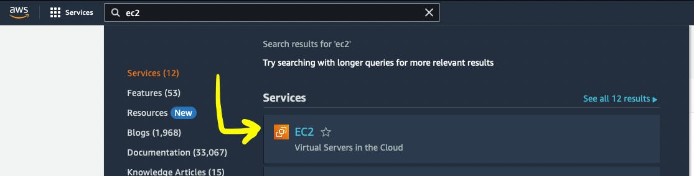
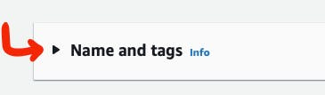
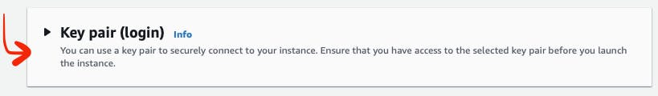
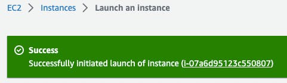

==============================================================================================================
Building a CI/CD Pipeline with AWS, K8S, Docker, Ansible, Git, Github, Apache Maven, and Jenkins \| HackerNoon
==============================================================================================================

Source: https://hackernoon.com/building-a-cicd-pipeline-with-aws-k8s-docker-ansible-git-github-apache-maven-and-jenkins

.. rubric:: **Motivation**
   :name: h-motivation

CI/CD is a technique for delivering apps to customers,
achieved by adding automation to different stages of
app development. I believe that grasping CI/CD
(Continuous Integration and Continuous Deployment) can
empower developers to gain a better understanding of
how backend project artifacts exist beyond the
boundaries of the project repository. This
comprehension can also create a fundamental shift in a
developer's perspective. Instead of merely viewing
their work as lines of code, they can start to embrace
the broader context of their project as a valuable
product.

In this article, we aim to demystify the CI/CD process
through practical application. We'll take you through
a step-by-step tutorial, breaking it down module by
module, where you'll build a CI/CD pipeline manually.
To do this, we'll harness the power of contemporary
DevOps tools like **AWS, Docker, Kubernetes, Ansible,
Git, Apache Maven,** and **Jenkins**. So, let's begin
this journey!

.. rubric:: **[Module 1]: AWS EC2 Virtual Server**
   :name: h-module-1-aws-ec-2-virtual-server

This module is dedicated to the creation of an AWS EC2
Virtual Server instance. As part of this article, you
will be setting up three EC2 instances for Jenkins,
Ansible, and Kubernetes. For now, you can proceed with
the next modules and revisit this module in "[module
2]: Jenkins", “[module 6]: Ansible" and "[module 7]:
Kubernetes" sections.

| 

.. rubric:: **Step 1: Create an AWS Account**
   :name: h-step-1-create-an-aws-account

Go to https://aws.amazon.com.

Click the button **Create an AWS Account**.

.. figure:: media/CICD-by-Zufar/CICD-by-Zufar-1.png
    :scale: 50 %
    
    The screenshot of AWS main web page with the
    pointer to "Create an AWS Account" button

Follow the instructions on the create account web
page.

.. rubric:: **Step 2: Sign In to your AWS Account**
   :name: h-step-2-sign-in-to-your-aws-account
    
Go to https://console.aws.amazon.com/console/home.
Click the **Sign In** button.

.. figure:: media/CICD-by-Zufar/CICD-by-Zufar-2.png
    :scale: 50 %

    The screenshot of AWS main web page with the
    pointer to "Sign In" button

Enter all necessary credentials on this web page.

.. rubric:: **Step 3: Find EC2 Virtual Server**
    :name: h-step-3-find-ec-2-virtual-server
    
Find EC2 in the search box.

.. figure:: media/CICD-by-Zufar/CICD-by-Zufar-3.png

    The screenshot of AWS web page with the pointer to
    the search box

Choose EC2 Virtual Server by clicking **EC2 Service**.

    The screenshot of AWS web page with the pointer to
    "EC2" AWS service

Click the button **Launch Instance**.

.. figure:: media/CICD-by-Zufar/CICD-by-Zufar-5.png

    The screenshot of AWS web page with the pointer to
    "Launch instance" button

.. rubric:: **Step 4: Configure “Name and tags“
    section**
    :name: h-step-4-configure-name-and-tags-section

Go to the **“Name and tags”** section.

    The screenshot of AWS web page with the pointer to
    "Name and tags" section

Provide a name for a new AWS EC2 Virtual Server
instance in the **“Name”** section.

.. figure:: media/CICD-by-Zufar/CICD-by-Zufar-7.png

    The screenshot of AWS web page with the pointer to
    "Name" input box in "Name and tags" section

You can also add additional tags for your virtual
server by clicking **”Add additional tags”**.

.. rubric:: **Step 5: Configure “Application and OS
    Images (Amazon Machine Image)“ section**
    :name: h-step-5-configure-application-and-os-images-amazon-machine-image-section

Go to the **"Application and OS Images (Amazon Machine
Image)"** section.

.. figure:: media/CICD-by-Zufar/CICD-by-Zufar-8.png

    The screenshot of AWS web page with the pointer to
    "Application and OS Images (Amazon Machine Image)"
    section

.. note::
    To play with the virtual server for **FREE**:

    #. Select the operating system for your virtual
        server - **Amazon Linux**.
    #. In the **Amazon Machine Image (AMI)** section,
        select a machine with the **Free tier eligible
        tag**.

.. figure:: media/CICD-by-Zufar/CICD-by-Zufar-9.png

    The screenshot of AWS web page with the pointer to
    "OS" and "Machine type" buttons in "Application and
    OS Images (Amazon Machine Image)" section

.. rubric:: **Step 6: Configure “Instance type“
    section**
    :name: h-step-6-configure-instance-type-section

Go to the **”Instance type”** section.

.. figure:: media/CICD-by-Zufar/CICD-by-Zufar-10.png

    The screenshot of AWS web page with the pointer to
    "Instance type" section

To play with the virtual server for **FREE**:

Select a type with the **Free tier eligible
tag** in the **Instance type** section.

For me it is **t2.micro (Family: t2 1cCPU 1 GiB
Memory Current generation:true)**.

.. figure:: media/CICD-by-Zufar/CICD-by-Zufar-11.png

    The screenshot of AWS web page with the pointer to
    "Instance type" dropdown in "Instance type" section

.. rubric:: **Step 7: Configure “Configure storage“
    section**
    :name: h-step-7-configure-configure-storage-section

Go to the **”Configure storage”** section.

.. figure:: media/CICD-by-Zufar/CICD-by-Zufar-12.png

    The screenshot of AWS web page with the pointer to
    "Configure storage" section

.. note::
    To play with the virtual server for **FREE**:
    Do not change default settings. Free tier eligible
    customers can get **30 GB of EBS General Purpose
    (SSD) or Magnetic storage**.

.. figure:: media/CICD-by-Zufar/CICD-by-Zufar-13.png

    The screenshot of AWS web page with the pointer to
    storage possible configurations in "Configure
    storage" section

.. rubric:: **Step 8: Configure “Network settings“
    section**
    :name: h-step-8-configure-network-settings-section

Go to the **“Network settings“** section.

.. figure:: media/CICD-by-Zufar/CICD-by-Zufar-14.png

    The screenshot of AWS web page with the pointer to
    "Network settings" section

You need to set up the security of your virtual
server. To do this,

#. Click on the **“Create security group”** button.
#. Add the name of your new security group in
the **“Security group name”** section.
#. Add a description of your new security group in
the **“Description”** section.

By default, your virtual server is accessible via
(**Type - SSH, Protocol - TCP, Port - 22**). If you
need additional connection types, add them by adding
additional inbound security group rules.    

.. figure:: media/CICD-by-Zufar/CICD-by-Zufar-15.png

    The screenshot of AWS web page with the pointer to
    "Security group" in "Network settings" section

.. rubric:: **Step 9: Configure “Key pair (login)“
   section**
   :name: h-step-9-configure-key-pair-login-section

Go to the **”Key pair (Login)”** section.

    The screenshot of AWS web page with the pointer to
    "Ket pair (login)" section

Create a new key-pair if you haven't created it yet.

.. figure:: media/CICD-by-Zufar/CICD-by-Zufar-17.png

    The screenshot of AWS web page with the pointer to
    "Key pair name", "Key pair type", "Private key file
    format" in "Ket pair (login)" section

If you haven't created **“key-pair”** yet:

#. Click the **“Create new key pair”** button.
#. Give your new key-pair a name in the **“Key pair
   name”** section.
#. Select key-pair type **RSA** or **ED25519**. I
   choose the **RSA** type.
#. Select Private key file format. Choice
   of **.pem** and **.ppk**. I choose
   the **.pem** format.
#. Click on the **“Create key pair”** button.
#. You will get a pop-up window that will prompt you
   to download the Private key file. Agree and
   download the file to your computer.

.. rubric:: **Step 10: Launch the EC2 Virtual Server
   Instance**
   :name: h-step-10-launch-the-ec-2-virtual-server-instance

Launch the EC2 Virtual Server instance by clicking the
button **“Launch instance”**.

.. figure:: media/CICD-by-Zufar/CICD-by-Zufar-18.png

    The screenshot of AWS web page with the pointer to
    "Launch Instance" button

After the completion of the EC2 Virtual Server
instance creation process, you will see the following.

    The screenshot of the AWS web page displaying a
    'Success' notification, indicating the successful
    completion of the EC2 Virtual Server instance
    creation process

Then you should go to the **“Instances“** section by
clicking **“View all instances”** button.

.. figure:: media/CICD-by-Zufar/CICD-by-Zufar-20.png

    The screenshot of AWS web page with the pointer to
    running EC2 instance

Now you can see that your AWS EC2 Virtual Server
instance is running.

--------------

.. rubric:: **[Module 2]: Jenkins Server**
   :name: h-module-2-jenkins-server

Now, let’s configure JenkinsServer on the EC2 Virtual
Server instance.

.. rubric:: **Step 1: Create an AWS EC2 Virtual Server
   instance**
   :name: h-step-1-create-an-aws-ec-2-virtual-server-instance

You need a virtual server to run Jenkins.

Follow instructions from **[Module 1]: AWS EC2 Virtual
Server** section of this tutorial to finish this step
and create an EC2 virtual server instance with the
name JenkinsServer.

.. warning::
   Do not forget to add a security group setup. It
   allows **Jenkins** and **SSH** to work on
   port **8080** and **22** respectively.

.. note::
   Use the name **“JenkinsServer”** to distinguish
   your EC2 Virtual Server instance.

.. note::
   Create **“CI_CD_Pipeline”** security group
   and **“CI_CD_Pipeline_Key_Pair“** for a
   new **“JenkinsServer”** AWS EC2 instance. You can
   reuse them further in the article.

.. rubric:: **Step 2: Connect to an AWS EC2 Virtual
   Server instance**
   :name: h-step-2-connect-to-an-aws-ec-2-virtual-server-instance

Go to **AWS Console home page** → **EC2 Management
Console Dashboard** → **Instances.**

Then you should choose **JenkinsServer** and then
click the **“Connect”** button.

.. figure:: media/CICD-by-Zufar/CICD-by-Zufar-21.png

    The screenshot of AWS "Instances" web page with the
    pointer to "Connect" button

Then you will see this web page. You should again
click the **“Connect”** button.

.. figure:: media/CICD-by-Zufar/CICD-by-Zufar-22.png

    The screenshot of AWS "Connect to Instance" web
    page with the pointer to "Connect" button

Now you can see EC2 virtual server instance online
terminal.

.. figure:: media/CICD-by-Zufar/CICD-by-Zufar-23.png

    The screenshot of AWS EC2 Virtual Server instance
    online terminal

.. rubric:: **Step 3: Download the Jenkins
   repository**
   :name: h-step-3-download-the-jenkins-repository

Now you need to download Jenkins on your EC2 virtual
server instance.

Follow these instructions:

#. Go to Jenkins
   download `webpage <https://www.jenkins.io/download>`__.

#. You can see Stable (LTS) and Regular releases
   (Weekly) options. Choose `Red
   Hat/Fedora/Alma/Rocky/CentOS <https://pkg.jenkins.io/redhat-stable>`__\ LTS
   option.

You will see this web page.

.. figure:: media/CICD-by-Zufar/CICD-by-Zufar-24.png

    The screenshot of Jenkins download web page

3. Copy **“sudo get..”** command and execute it to
   download Jenkins files from the Jenkins repository
   on the Internet and save them to the specified
   location on your EC2 virtual server instance.

.. code:: bash

   sudo wget -O /etc/yum.repos.d/jenkins.repo https://pkg.jenkins.io/redhat-stable/jenkins.repo

Now Jenkins is downloaded.

.. rubric:: **Step 4: Import Jenkins key**
   :name: h-step-4-import-jenkins-key

To finish the Jenkins installation, we need to import
the Jenkins key.

To import the Jenkins key we need to copy the **“sudo
rpm..”** command and execute it.

.. code:: bash

   sudo rpm --import https://pkg.jenkins.io/redhat-stable/jenkins.io-2023.key

.. container:: notice notice-info

   This way **“rpm”** package manager can verify that
   the Jenkins packages you install are exactly the
   ones published by the Jenkins project, and that
   they haven't been tampered with or corrupted.

.. rubric:: **Step 5: Install Java**
   :name: h-step-5-install-java

To run Jenkins, we need to install **Java** on our EC2
virtual server instance.

To install **Java**, use this command.

| 

.. code:: bash

   sudo amazon-linux-extras install java-openjdk11 -y

| 

Verify whether
**Java**
was installed correctly using this command:

.. code:: bash

   java -version

You will see something like that.

.. figure:: media/CICD-by-Zufar/CICD-by-Zufar-25.png

    The screenshot of AWS EC2 Virtual Server instance
    online terminal with installed JDK 11

.. rubric:: **Step 6: Install fontconfig**
   :name: h-step-6-install-fontconfig

To run Jenkins, you need to install **fontconfig** on
our EC2 virtual server instance.

Use this command.

.. code:: bash

   sudo yum install fontconfig java-11-openjdk -y

.. note::

   Fontconfig is a library designed to provide
   system-wide font configuration, customization and
   application access. It's required by Jenkins
   because Jenkins has features that render fonts.

.. rubric:: **Step 7: Install Jenkins**
   :name: h-step-7-install-jenkins

In earlier steps, you configured your EC2 virtual
server instance to use a specific Jenkins repository
and then you imported the GPG key associated with this
repository. Now, you need to run the command that will
search all the repositories it knows about, including
the Jenkins one you added, to find the Jenkins
package. Once it finds the Jenkins package in the
Jenkins repository, it will download and install it.

Let’s run this command.

.. code:: bash

   sudo yum install jenkins -y

.. rubric:: **Step 8: Start Jenkins**
   :name: h-step-8-start-jenkins

You can start Jenkins using this command.

.. code:: bash

   sudo systemctl start jenkins

To check that Jenkins is running use this command.

.. code:: bash

   sudo systemctl status jenkins

You will see the output as it is on the screenshot
below:

.. figure:: media/CICD-by-Zufar/CICD-by-Zufar-26.png

    The screenshot of AWS EC2 Virtual Server instance
    online terminal with installed Jenkins

Jenkins should now be up and running.

.. rubric:: **Step 9: Access Jenkins**
   :name: h-step-9-access-jenkins

To access the Jenkins application, open any web
browser and enter your EC2 instance’s public IP
address or domain name followed by port 8080.

.. code:: bash

   http://<your-ec2-ip>:8080

The first time you access Jenkins, it will be locked
with an autogenerated password.

.. figure:: media/CICD-by-Zufar/CICD-by-Zufar-27.png

    The screenshot of Jenkins installed on AWS EC2
    Virtual Server with the pointer to Administrator
    password

You need to display this password using the following
command.

.. code:: bash

   sudo cat /var/lib/jenkins/secrets/initialAdminPassword

Copy this password, return to your browser, paste it
into the Administrator password field, and click
"Continue".

Then you will be able to see this web page.

.. figure:: media/CICD-by-Zufar/CICD-by-Zufar-28.png

    The screenshot of Jenkins installed on AWS EC2
    Virtual Server with the pointer to "Customize
    Jenkins" web page

Now, you can use your Jenkins Server.

.. rubric:: **Step 10: Create new Jenkins pipeline**
   :name: h-step-10-create-new-jenkins-pipeline

Now, as Jenkins is working fine, you can start
creating the Jenkins pipeline. To create Jenkins
pipeline you need to create a new “Freestyle project”.
To create a new “Freestyle project” you need to go to
the Jenkins dashboard and click the **“New
Item”** button.

.. figure:: media/CICD-by-Zufar/CICD-by-Zufar-29.png

    The screenshot of Jenkins Dashboard web page with
    the pointer to "New Item" button

Enter the name of the Github “Freestyle project”
(“pipeline” name is going to be used further) and then
click the button **“OK”**.

.. figure:: media/CICD-by-Zufar/CICD-by-Zufar-30.png

    The screenshot of Jenkins New Item web page with
    the pointer to "Item name" item box

Then provide the **Description** of the pipeline.